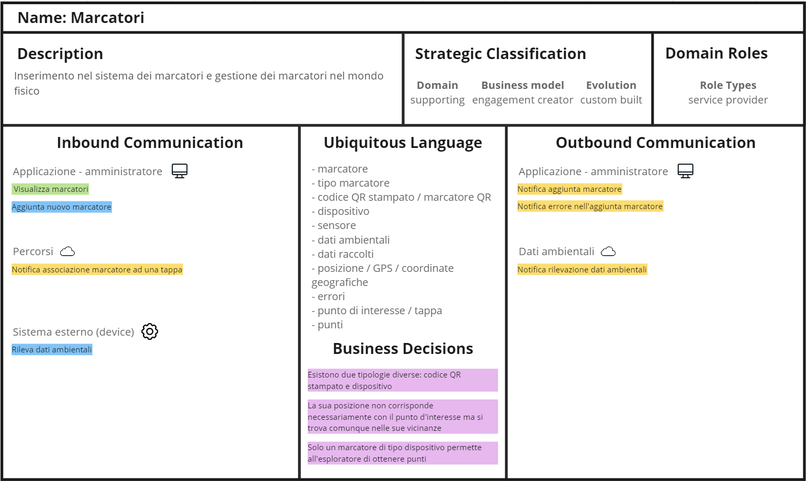
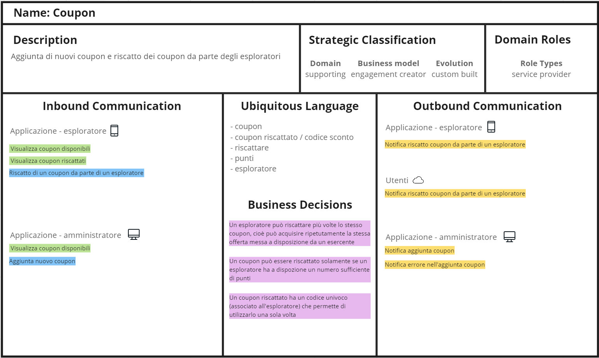

# Bounded Context

[Fig ] Bounded Context Percorsi

[Fig ] Bounded Context Marcatori

[Fig ] Bounded Context Dati Ambientali

[Fig ] Bounded Context Coupon

[Fig ] Bounded Context Utenti

## Context Map

[Fig ] Context Map

