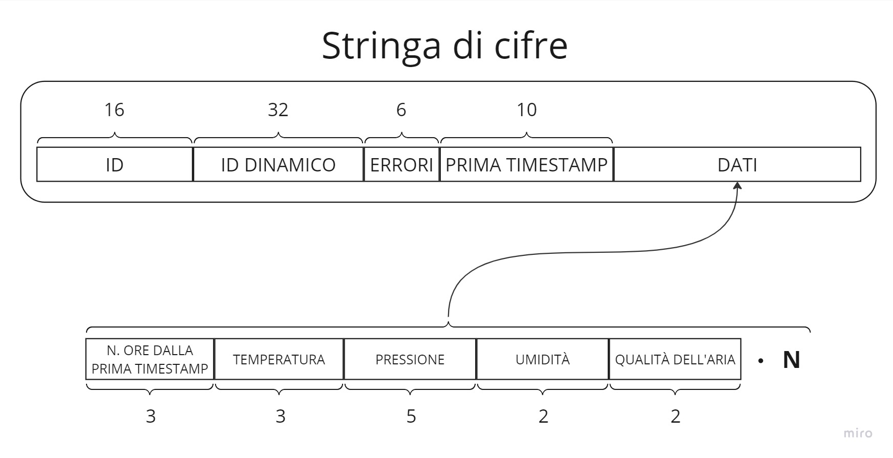

# Architettura di Dettaglio
Per avere una visione della struttura generale del sistema, è stato creato un diagramma delle classi (<a href="#fig1">Figura 1</a>). Esso modella la suddivisione del sistema negli elementi precedentemente individuati, cercando inoltre di rappresentare le relazioni presenti tra i vari componenti:

- itinerari: rappresentano l'elemento di livello più alto tra quelli che realizzano i percorsi che gli utenti possono svolgere. Ciascun itinerario ha al suo interno informazioni come nome, descrizione e punti che si ottengono al completamento e può appartenere ad una delle cinque tipologie di itinerari che sono state individuate durante l'analisi. Essi sono in relazione con una o più tappe che corrispondono appunto ai punti di interesse da visitare durante l'itinerario;
- tappe: si tratta di un elemento che rappresenta i punti di interesse da visitare astraendo però gli aspetti fisici del sistema. E' uno degli elementi più importanti del sistema e mette in relazione gli itinerari proposti con i marcatori disseminati per il territorio di interesse. Al suo interno sono presenti inoltre una serie di informazioni utili agli utenti che sono intenzionati a visitare la tappa;
- marcatori: modella i marcatori che sono presenti nel territorio ed infatti presentano informazioni come le coordinate geografiche di un marcatore da raggiungere. Si distingue in due sotto elementi, così come anticipato durante la fase di analisi, per rappresentare sia un semplice QR code statico sia un marcatore composto da un dispositivo smart;
- coupon: è un elemento semplice che modella i coupon di sconto che gli utenti possono riscattare. Ha al suo interno informazioni per descrivere il tipo di offerta, l'azienda che mette a disposizione lo sconto e il numero di punti richiesto per ottenerlo. Nel caso di acquisto da parte di un utente, un coupon è anche associato ad un sotto elemento che modella un codice univoco utilizzabile dall'utente per usufruire dell'offerta;
- utenti: comprende tre tipologie di utenti divisi in guest, esploratori ed amministratori. Essi si differenziano sia per la loro registrazione o meno al sistema sia per il loro ruolo e l'interazione con gli altri elementi che ne consegue;
- itinerari completati: rappresenta gli itinerari che sono stati effettuati dagli utenti e il suo scopo è principalmente di fornire un elemento utile per rappresentare lo storico degli utenti e per effettuare alcune analisi da parte degli amministratori;
- misure ambientali: raccoglie una serie di informazioni registrate dai sensori presenti in un dispositivo. Si è cercato di rendere le misure raccolte il più possibile separate dai dispositivi dai quali provengono in modo da poter essere analizzate agevolmente ed indipendentemente dalla struttura realizzata nel sistema.

[Figura 1] Diagramma delle classi

Per quanto riguarda il sistema in dettaglio, è stata adottata una suddivisione in due elementi principali, che verranno successivamente approfonditi: la web app (detta anche explorer app) e il dispositivo (chiamato anche device). Considerando che il sistema è destinato all'uso all'aperto da parte di cittadini e turisti, l'interazione dell'utilizzatore con funzionalità come la mappa dei percorsi e la scansione dei codici QR avverrà principalmente attraverso smartphone. Inoltre, è necessario che un dipendente del Comune possa utilizzarlo tramite un computer da ufficio. Per queste ragioni, è stata scelta l'implementazione di un'applicazione web unica, piuttosto che un'app mobile.

## Web app
A seguito dell'analisi dei requisiti, capite le esigenze del possibile committente, sono state ideate due architetture del sistema da utilizzare rispettivamente durante la fase di sviluppo interno e durante il deploy del sistema.
Entrambe le architetture dividono la web application in tre macro componenti che sono:
- frontend: responsabile della parte grafica dell'applicazione, permette il rendering dell'interfaccia utente e l'interazione con il sistema da parte degli utenti finali;
- backend: attraverso la sua architettura REST API permette di ottenere e/o inserire dati nel sistema;
- database: rende possibile il mantenimento dei dati del sistema e fornisce metodi per l'accesso ottimizzato ad essi.

Ciascuno di questi tre componenti risiede all'interno di un container *Docker*
<a href="#1">[1]</a> dedicato al fine di rendere il sistema modulare e facilmente installabile dato che, grazie alle configurazioni presenti per ciascuno di essi e al tool *Docker Compose* <a href="#2">[2]</a>, è possibile avviare l'intero sistema attraverso un unico comando e senza la necessità di dover installare o configurare librerie esterne necessarie durante l'esecuzione.
Come già accennato, la prima delle due architetture ideate è pensata per lo sviluppo agevole del sistema e, in <a href="#fig2">Figura 2</a>, si può osservare uno schema riassuntivo di essa.

[Figura 2] Architettura del sistema durante lo sviluppo

Il sistema così realizzato è pensato per essere eseguito in locale sulla macchina dello sviluppatore mantenendo al tempo stesso i benefici di modularità e configurazione automatica dell'ambiente di esecuzione.
Questa architettura è utile per poter permettere ad ogni sviluppatore di avere una copia del sistema intero per poter sviluppare in modo indipendente dagli altri le proprie parti implementative. Essa, ovviamente, non permette l'utilizzo da parte degli utenti finali, per questo motivo, la seconda architettura mostrata in <a href="#fig3">Figura 3</a>, è stata realizzata principalmente per permettere l'effettivo utilizzo del sistema una volta completato.

[Figura 3] Architettura del sistema completato

Questa seconda architettura è pensata per essere impiegata utilizzando un server remoto dove, oltre al sistema sviluppato, è presente anche un reverse proxy server realizzato utilizzando *NGINX* <a href="#3">[3]</a>. Una volta configurato, il reverse proxy server permette a client esterni di interagire con le istanze dei container docker presenti nel server e che ospitano, in maniera simile a prima, i macro componenti del sistema.

Dal momento che la maggior parte delle informazioni dell'applicazione saranno visionabili mediante una mappa, grafici statistici o in formato testuale, si è deciso di porsi come problema e obiettivo quello di rendere accessibile l'interfaccia dell'applicazione, con particolare attenzione alle persone daltoniche e dislessiche.\
Il design dell'interfaccia utente è stato eseguito considerando che la maggior parte degli utilizzatori dell'applicazione vi accederanno tramite smartphone, come già accennato in precedenza, per cui è stato seguito un approccio *mobile-first*. \
Inoltre, si è seguito uno stile minimale nella progettazione delle schermate, con lo scopo di rendere più facilmente comprensibile all'utilizzatore il ruolo di ciascun componente nell'applicazione. Per lo stesso motivo, sono stati adottati o progettati i componenti grafici cercando di seguire alcuni standard de facto sul web, in modo che l'utente possa facilmente acquisire una certa familiarità con l'applicazione.

## Dispositivo
Analizzando i requisiti son state dedotte diverse informazioni che hanno permesso di passare alla fase di progettazione del dispositivo. Per prima cosa, anche per motivi di costi, il dispositivo deve essere molto semplice e avere il minimo numero di componenti.\
Esso deve avere la possibilità di essere posizionato lontano da centri abitati e funzionare anche se scollegato da alimentazione e dalla connessione internet. Deve essere quindi il più possibile autonomo. Per fare ciò è necessario che abbia una alimentazione a batteria con l'eventuale ricarica tramite pannello fotovoltaico.\
Deve riconoscere i guasti non gravi in modo da notificarlo agli amministratori.
Inoltre, il sistema deve essere ottimizzato allo scopo di risparmiare energia e comunque avere tempi di risposta brevi.

Il dispositivo ha due funzioni principali:
- raccogliere periodicamente dati ambientali;
- generare un codice QR a richiesta.

Per raccogliere periodicamente i dati ambientali deve innanzitutto potere ottenere data e ora senza l'utilizzo di internet. Dato che il dispositivo è pensato per rimanere all'esterno, si è pensato di utilizzare il GPS. Questo infatti, oltre a fornire le coordinate geografiche, fornisce anche data e ora. In questo modo, il dispositivo rimane sempre aggiornato e non è necessario impostare alcun dato manualmente.
Per rilevare i dati ambientali è invece necessario l'utilizzo di un sensore che converta da valori fisici a valori digitali.\
Essendo appunto scollegato da internet, l'unica maniera che il dispositivo ha di inviare i dati raccolti è tramite lo smartphone dell'utente. Attraverso la scansione del codice QR quindi, deve essere possibile ottenere sia un codice univoco che permette la verifica del fatto che l'utente sia effettivamente passato da quel dispositivo, sia i dati ambientali raccolti fino a quel momento. Per possedere tutte queste informazioni il codice QR deve contenere una stringa di cifre, come mostrato nell'immagine sottostante.

[Figura 4] Stringa dati del QR code

Nel dettaglio, il pacchetto è composto da:
- ID - sequenza di 16 cifre univoca;
- ID dinamico - sequenza di 32 cifre univoca che cambia ogni volta che viene generato un codice QR;
- Errori - sequenza di 6 cifre, ognuna rappresenta un errore;
- Prima timestamp - sequenza di 10 cifre, per la prima timestamp catturata dal dispositivo;
- Dati - sequenza di cifre la cui lunghezza equivale al numero dei dati raccolti dal dispositivo, ogni dato è composto da:

    - Numero di ore dalla prima timestamp - sequenza composta da 3 cifre;
    - Temperatura - sequenza composta da 3 cifre, dove la prima indica il segno;
    - Pressione - sequenza di 5 cifre;
    - Umidità - sequenza di 2 cifre;
    - Qualità dell'aria - sequenza di 2 cifre.

Una volta definito ciò che è necessario per il dispositivo, è stato realizzato il seguente diagramma a blocchi che rappresenta l'architettura generale del sistema.

[Figura 5] Architettura del dispositivo

Come si può vedere dal diagramma, il dispositivo è composto da diversi elementi:

- l'ESP32, il core del dispositivo che gestisce tutti gli altri componenti;
- lo schermo per mostrare i dati all'utente, comunica tramite interfaccia SPI;
- il modulo GPS per ottenere la posizione e il tempo attuale, comunica tramite interfaccia UART;
- il sensore per ottenere dati ambientali, comunica tramite interfaccia I2C;
- il pulsante di reset per cancellare tutto quello che è stato salvato;
- il pulsante per aggiornare il codice QR e stampare a schermo;
- la batteria che fornisce alimentazione al dispositivo;
- il pannello fotovoltaico per ricaricare la batteria.

Questa architettura rispecchia sia la parte firmware che la parte hardware, infatti ognuno di questi componenti e la loro interazione è fondamentale per il corretto funzionamento del sistema.\
Inoltre è stato realizzato uno schema hardware per definire meglio come i vari componenti sono collegati tra di loro.

[Figura 6] Schema collegamenti del dispositivo

Nell'immagine sotto riportata viene mostrato un modello 3D di come potrebbe essere realizzato il dispositivo fisico.
Simile ad una casetta per uccelli, che come tetto ha dei pannelli fotovoltaici e di fronte mostra il display ed il pulsante per ottenere il codice QR da scansionare. Inoltre presenta dei fori laterali per il ricircolo dell'aria.

[Figura 7] Modello 3D di un possibile dispositivo

## Riferimenti

<a id="1">[1]</a> Docker, https://www.docker.com/

<a id="2">[2]</a> Docker Compose, https://docs.docker.com/compose/

<a id="3">[3]</a> NGINX, https://www.nginx.com/