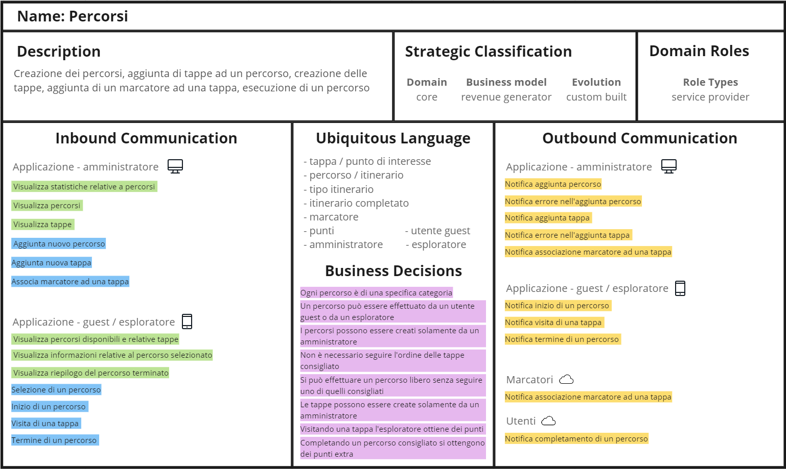
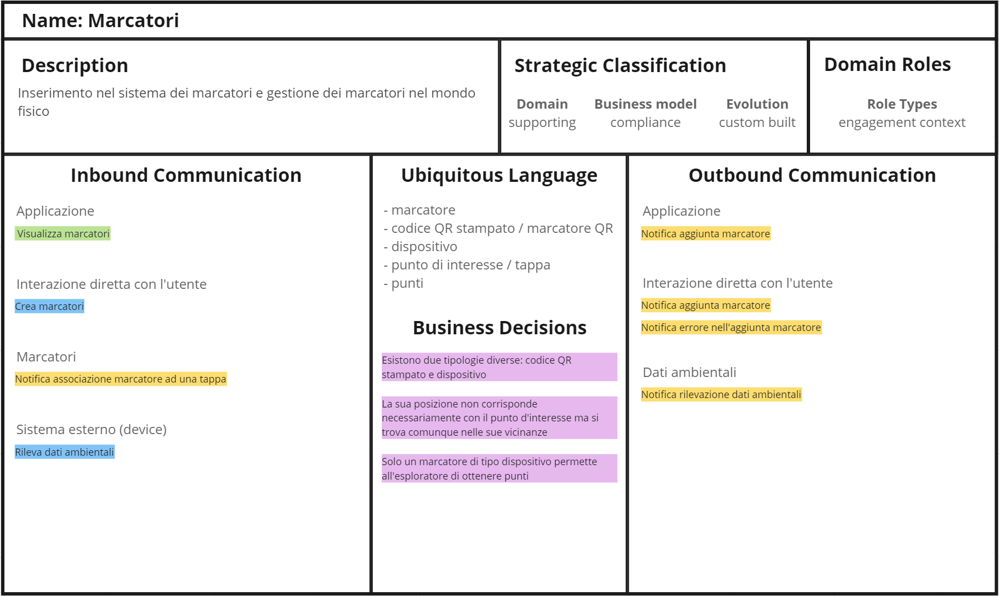
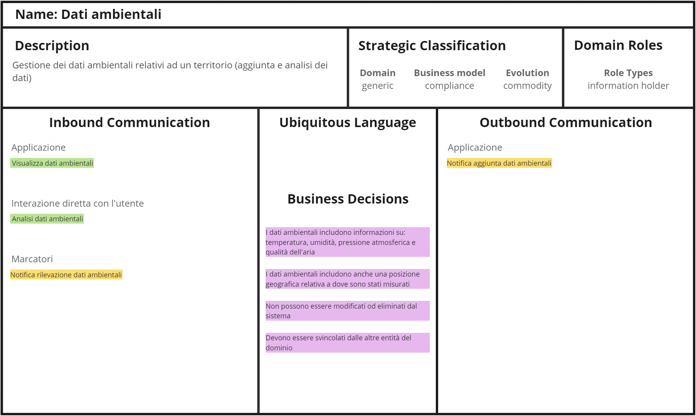
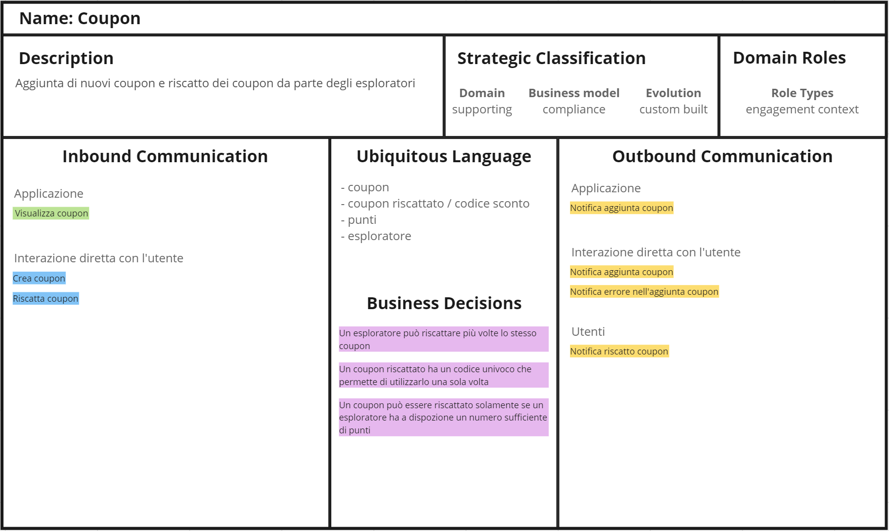
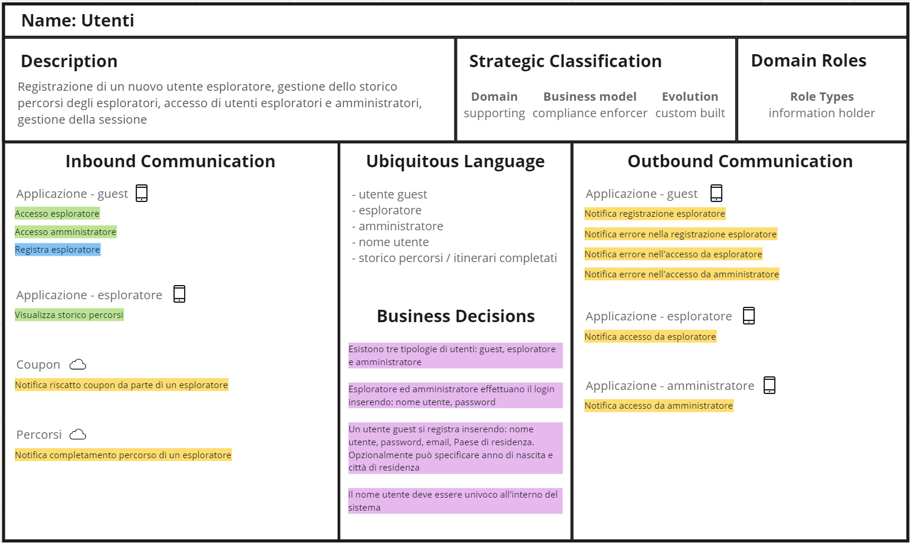
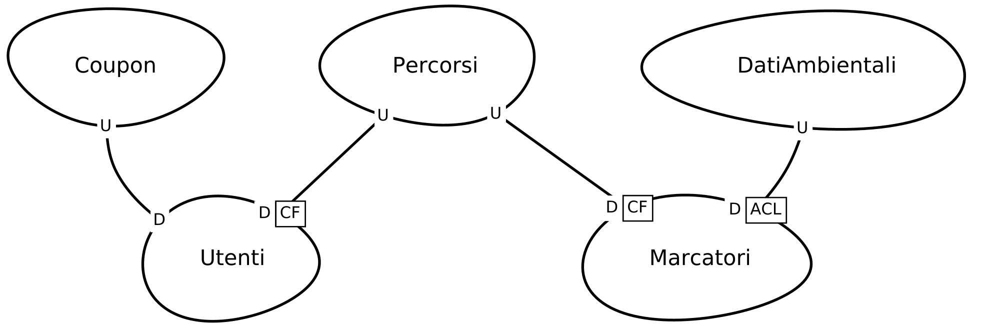

# Bounded Context
Nel caso di questo progetto, i Bounded Context vengono a sovrapporsi con i sottodomini individuati. In altre parole, i sottodomini individuati durante la fase di Analisi del Dominio rappresetnao già le diverse aree di confine all'interno del sistema, senza ulteriori suddivisioni in Bounded Context. La corrispondenza diretta tra i Bounded Context e i sottodomini si riflette in porzioni del sistema autocontenute e caratterizzate da un modello del dominio ben definito. Questa parte comprende anche i livelli infrastrutturali, di persistenza e di presentazione. Ciascun Bounded Context espone una propria interfaccia per consentire agli altri di accedere al proprio contenuto, vietando l'accesso diretto.\
Tale struttura consente una gestione chiara e distinta delle diverse funzionalità, agevolando l'implementazione di parti facilmente riconoscibili all'interno dell'architettura dell'applicazione, sia dal punto di vista del codice che nella gestione dei dati.

Nei seguenti diagrammi dei Bounded Context sono stati utilizzati i seguenti colori associandoli ad uno specifico significato:
- verde: query;
- azzurro: comando;
- giallo: evento;
- rosa: decisione di business.

### Bounded Context Percorsi
Nel diagramma in <a href="#fig1">Figura 1</a> è schematizzato il Bounded Context relativo ai percorsi.

[Figura 1] Bounded Context Percorsi

### Bounded Context Marcatori
Nel diagramma in <a href="#fig2">Figura 2</a> è schematizzato il Bounded Context relativo ai marcatori.

[Figura 2] Bounded Context Marcatori

### Bounded Context Dati Ambientali
Nel diagramma in <a href="#fig3">Figura 3</a> è schematizzato il Bounded Context relativo ai dati ambientali.

[Figura 3] Bounded Context Dati Ambientali

### Bounded Context Coupon
Nel diagramma in <a href="#fig4">Figura 4</a> è schematizzato il Bounded Context relativo ai coupon.

[Figura 4] Bounded Context Coupon

### Bounded Context Utenti
Nel diagramma in <a href="#fig5">Figura 5</a> è schematizzato il Bounded Context relativo agli utenti.

[Figura 5] Bounded Context Utenti

## Context Map
Il diagramma in <a href="#fig6">Figura 6</a> rappresenta le interazioni e le relazioni tra i Bounded Context, offrendo una migliore comprensione di come le varie parti del sistema comunicano tra loro, identificando le dipendenze e connessioni tra esse.

Il Bounded Context dei percorsi si distingue come il nucleo centrale del sistema, in quanto gestisce gli elementi fondamentali. Questa posizione si riflette nelle relazioni con i Bounded Context di utenti e marcatori, poiché essi devono conformarsi al modello definito dal Bounded Context dei percorsi, che svolge il ruolo di "upstream" per loro.

Similmente, il Bounded Context degli utenti è "downstream" rispetto a quello relativo ai coupon, poiché la loro relazione si concentra principalmente sull'associazione dei coupon riscattati dagli esploratori. Pertanto, è stato scelto di attribuire una posizione di rilievo al Bounded Context dei coupon, ma senza la necessità di una relazione *Conformist*.

Nel caso della relazione tra il Bounded Context dei marcatori e quello dei dati ambientali, è stata stabilita una posizione "downstream" per i marcatori. In questo contesto, è stato implementato un *Anti Corruption Layer*, poiché le rilevazioni che avvengono nel Bounded Context dei marcatori, richiedono una traduzione e un adattamento ai requisiti specifici del modello dela Bounded Context dei dati ambientali.

[Figura 6] Context Map

