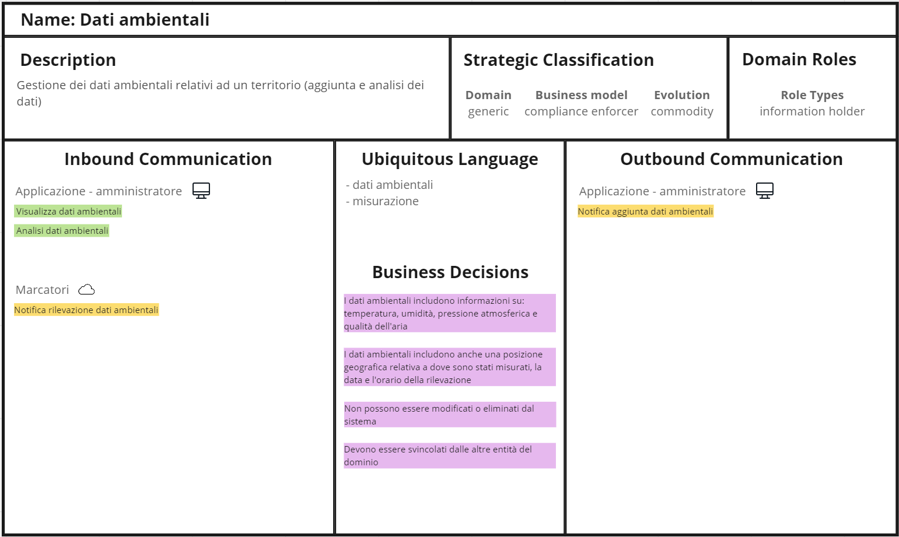
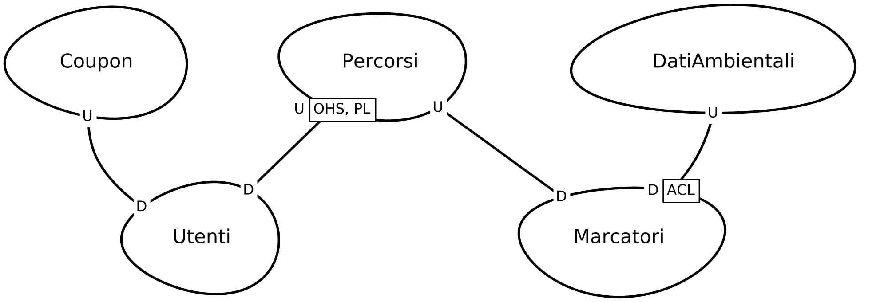

# Bounded Context
Nel caso di questo progetto, i _Bounded Context_ vengono a sovrapporsi con i sottodomini individuati. In altre parole, i sottodomini individuati durante la fase di Analisi del Dominio rappresentano già le diverse aree di confine all'interno del sistema, senza ulteriori suddivisioni in _Bounded Context_. La corrispondenza diretta tra i _Bounded Context_ e i sottodomini si riflette in porzioni del sistema autocontenute e caratterizzate da un modello del dominio ben definito. Questa parte comprende anche i livelli infrastrutturali, di persistenza e di presentazione. Ciascun _Bounded Context_ espone una propria interfaccia per consentire agli altri di accedere al proprio contenuto, vietando l'accesso diretto.\
Tale struttura consente una gestione chiara e distinta delle diverse funzionalità, agevolando l'implementazione di parti facilmente riconoscibili all'interno dell'architettura dell'applicazione, sia dal punto di vista del codice che nella gestione dei dati.

Nei seguenti diagrammi dei _Bounded Context_ sono stati utilizzati i seguenti colori associandoli ad uno specifico significato:
- verde: query;
- azzurro: comando;
- giallo: evento;
- rosa: decisione di business.

### Bounded Context Percorsi

[Figura 1] Bounded Context Percorsi

Questo _Bounded Context_ è un "revenue generator" perché essendo quello che gestisce i percorsi è il core del sistema, per questo motivo è "custom built" e quindi realizzato completamente dall'organizzazione. Il ruolo del dominio è quello di "service provider" dato che offre un servizio fondamentale per il sistema.

I messaggi in ingresso, per quanto riguarda l'Applicazione lato amministratore, sono le query di visualizzazione dei percorsi, delle statistiche e delle tappe, mentre per i comandi c'è l'aggiunta di un nuovo percorso, l'aggiunta di una nuova tappa e l'associazione di un marcatore ad una tappa.\
Per l'Applicazione lato guest/esploratore invece ci sono le query di visualizzazione dei percorsi disponibili, le informazioni relative al percorso e il riepilogo a percorso terminato. Per quanto riguarda i comandi ci sono la selezione di un percorso, l'avvio del percorso selezionato, la visita ad una tappa e la conclusione del percorso.

Per i messaggi in uscita abbiamo gli eventi di notifica all'Applicazione lato amministratore che riguardano l'avvenuta aggiunta di percorsi, tappe e la associazione di un marcatore ad una tappa. Per l'Applicazione lato guest/esploratore sono presenti gli eventi di notifica inizio percorso, visita di una tappa e conclusione del percorso.
Il _Bounded Context_ Marcatori riceve un evento che notifica l'associazione di un marcatore ad una tappa, mentre per il _Bounded Context_ Utenti l'evento che notifica il completamento di un percorso.

Tra le business decisions, è stato stabilito che sia gli utenti guest che gli esploratori possono effettuare un percorso, mentre solo gli amministratori possono creare tappe e percorsi. Inoltre, ogni tappa concede punti solo agli esploratori e non è obbligatorio seguire i percorsi suggeriti.

### Bounded Context Marcatori

[Figura 2] Bounded Context Marcatori

Questo _Bounded Context_ assume il ruolo di "engagement creator", poiché non possiede le funzionalità fondamentali del sistema, ma l'utilizzatore ne interagisce direttamente. Anche questo è stato creato su misura ("custom built") e interamente sviluppato all'interno dell'organizzazione. Esso è considerato un "service provider", poiché va oltre la semplice archiviazione di informazioni (come nel caso di "information holder"), offrendo anche un servizio: l'integrazione dei marcatori nel sistema e la loro gestione nell'ambiente fisico.

Come messaggi di ingresso da parte dell'Applicazione lato amministratore ci sono la query di visualizzazione di tutti i marcatori e il comando di aggiunta di un un nuovo marcatore. In più, il _Bounded Context_ Percorsi invia una notifica quando il marcatore viene associato ad una tappa e un comando di rilevazione dei dati ambientali forniti dal sistema esterno.

Per quanto riguarda i messaggi in uscita, ci sono eventi di notifica diretti all'Applicazione lato amministratore, informando dell'aggiunta di un marcatore e notificando errori. Per quanto riguarda il _Bounded Context_ Dati Ambientali, viene generato un evento di notifica per segnalare l'avvenuta rilevazione dei dati ambientali.

Tra le business decisions riportate, le principali sono la presenza di due tipologie di marcatori (codice QR stampato e dispositivo) e l'ottenimento dei punti avviene solo nel caso di marcatore di tipo dispositivo.

### Bounded Context Dati Ambientali

[Figura 3] Bounded Context Dati Ambientali

Questo _Bounded Context_ svolge la funzione di "compliance enforcer", essenziale per soddisfare i requisiti prefissati, seppur non rappresenti un elemento centrale né per il sistema né per gli utenti che lo utilizzano. Vengono utilizzati sistemi esterni preesistenti senza effettuare modifiche ad essi, perciò si parla di "commodity". Esso si occupa dalla conservazione di dati informativi (i dati ambientali rilevati) e dalla presenza di logica minima (analisi base dei dati). Per questa ragione, viene identificato come "information holder".

Le comunicazioni in ingresso comprendono richieste di visualizzazione e analisi dei dati ambientali dall'Applicazione lato amministratore, nonché l'evento di notifica generato quando il _Bounded Context_ Marcatore rileva i dati ambientali.

Per quanto riguarda le comunicazioni in uscita, vi è un unico evento di notifica destinato all'Applicazione lato amministratore, il quale informa dell'aggiunta dei dati ambientali.

Tra le business decisions prese, si evidenzia che i dati ambientali rilevati includono dettagli come la posizione geografica, la data e l'ora. Tali dati non possono essere soggetti a modifiche o eliminazioni all'interno del sistema e devono essere completamente indipendenti dalle altre entità del dominio.

### Bounded Context Coupon

[Figura 4] Bounded Context Coupon

Questo _Bounded Context_ assume il ruolo di "engagement creator", poiché non possiede le funzionalità fondamentali del sistema, ma l'utilizzatore ne interagisce direttamente. È stato creato internamente, seguendo un approccio "custom built".  Esso si occupa dell'intera gestione dei coupon, compresi i dati informativi e la completa logica di funzionamento. Per questa ragione, viene identificato come "service provider".

I messaggi vengono inviati a questo contesto quando un utente esploratore desidera visualizzare l'elenco dei coupon disponibili e di quelli che ha riscattato. In più, l'esploratore può anche riscattare un coupon tra quelli disponibili. Sempre come messaggio in entrata, un amministratore richiede attraverso l'Applicazione la visualizzazione di tutti i coupon disponibili e vuole aggiungerne dei nuovi.

Nel caso di riscatto di un coupon da parte di un esploratore, il _Bounded Context_ comunica con l'Applicazione dell'esploratore e con il _Bounded Context_ Utenti. Analogamente, in caso di successo o errore durante l'aggiunta di un nuovo coupon, il _Bounded Context_ comunica con l'Applicazione dell'amministratore.

In termini di business decisions, si è stabilito che un esploratore può riscattare più volte uno stesso coupon, ossia fruire più volte della stessa offerta. Ogni volta che un coupon viene riscattato, viene associato ad esso un codice univoco collegato anche all'esploratore, garantendo così la possibilità di utilizzarlo in un'unica occasione. È importante sottolineare che un coupon può essere riscattato solamente se l'esploratore dispone di un quantitativo di punti sufficiente.

### Bounded Context Utenti

[Figura 5] Bounded Context Utenti

Questo _Bounded Context_ assume il ruolo di "compliance enforcer", poiché contribuisce al corretto funzionamento del sistema senza avere ulteriori scopi specifici. Anche questo è stato creato su misura ("custom built") e interamente sviluppato all'interno dell'organizzazione.  Esso si occupa dalla conservazione di dati informativi (come l'elenco degli esploratori e degli amministratori) e dalla presenza di logica minima (login, logout, gestione delle sessioni, storico dei percorsi). Per questa ragione, viene identificato come "information holder".

I messaggi vengono inviati a questo contesto quando un utente guest desidera registrarsi come esploratore oppure quando vuole effettuare l'accesso come esploratore o amministratore. Sempre come messaggio in entrata, un esploratore richiede attraverso l'Applicazione la visualizzazione del suo storico percorsi. Il _Bounded Context_ Utenti riceve notifiche dal _Bounded Context_ Coupon quando avviene un riscatto di un coupon da parte di un esploratore e dal _Bounded Context_ Percorsi quando un esploratore completa un percorso.

Nel caso di successo o errore durante la registrazione oppure di errore durante l'accesso, il _Bounded Context_ comunica con l'Applicazione dell'utente guest. Analogamente, per gli esploratori e gli amministratori che riescono ad accedere con successo, il _Bounded Context_ avvisa l'Applicazione appropriata.

In termini di business decisions, si è stabilito che gli utenti siano suddivisi in tre categorie: guest, esploratori e amministratori. È essenziale che i nomi utente forniti durante la registrazione come esploratori e l'assegnazione del ruolo di amministratore siano univoci all'interno del sistema.

## Context Map
Il diagramma in <a href="#fig6">Figura 6</a> rappresenta le interazioni e le relazioni tra i _Bounded Context_, offrendo una migliore comprensione di come le varie parti del sistema comunicano tra loro, identificando le dipendenze e connessioni tra esse.

Il _Bounded Context_ Percorsi si distingue come il nucleo centrale del sistema, in quanto gestisce gli elementi fondamentali. Questa posizione si riflette nelle relazioni con i _Bounded Context_ Utenti e Marcatori, poiché modifiche nel modello definito dal _Bounded Context_ Percorsi, che svolge il ruolo di _upstream_, hanno ripercussioni sugli altri due _Bounded Context_ e non viceversa. Dal momento che il _Bounded Context_ Utenti ha bisogno di accedere all'elenco dei percorsi per poter visualizzare correttamente le informazioni riguardanti lo storico di un esploratore, esso accede a questi dati tramite un'interfaccia messa a disposizione dal _Bounded Context_ Percorsi. Questa interazione avviene tramite un protocollo _Open-Host Service_.

Similmente, il _Bounded Context_ Utenti è _downstream_ rispetto a quello relativo ai Coupon, poiché la loro relazione si concentra principalmente sull'associazione dei coupon riscattati dagli esploratori. Pertanto, è stato scelto di attribuire una posizione di rilievo al _Bounded Context_ Coupon.

Nel caso della relazione tra il _Bounded Context_ Marcatori e il _Bounded Context_ Dati Ambientali, è stata stabilita una posizione _downstream_ per i Marcatori. In questo contesto, è stato implementato un _Anti Corruption Layer_, poiché le rilevazioni che avvengono nel _Bounded Context_ Marcatori, richiedono una traduzione e un adattamento ai requisiti specifici del modello del _Bounded Context_ Dati Ambientali.

[Figura 6] Context Map

