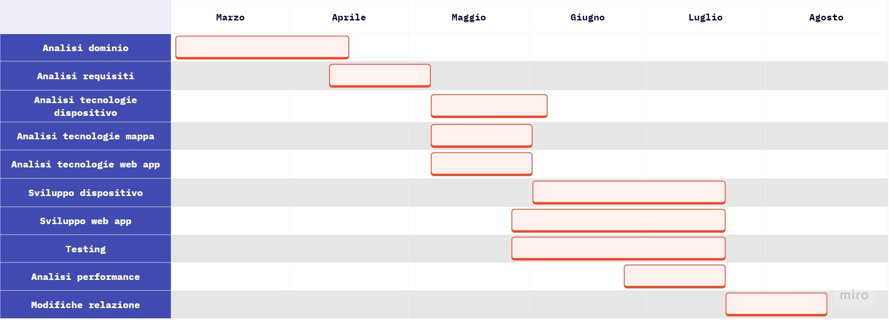

# Processo di Sviluppo
Durante tutta la durata del progetto è stato attuato un approccio incrementale ibrido con il modello aglie di *Kanban*, cioè un processo di sviluppo che si adatta alle esigenze del team. Questa scelta è stata presa, perché sia durante l'analisi del dominio che durante la successiva definizione dei requisiti, entrambe svolte collettivamente da tutti i membri del team di sviluppo, è emerso che le funzionalità richieste erano definite in modo chiaro.  Al fine di organizzare il lavoro in modo efficace, si è quindi optato per l'utilizzo di una board condivisa, utilizzando un approccio simile a *Kanban*. La board è suddivisa in tre colonne: "Da fare", "In corso" e "Completato". Inoltre, è stata divisa in tante righe quante le categorie generali del progetto: "doc", "frontend", "backend", "database", "device", "repository" e "varie". 

Con questa organizzazione, le funzionalità emerse dall'analisi dei requisiti e le altre attività necessarie sono state priorizzate in base all'importanza e collocate nelle rispettive categorie. Questo approccio ha consentito di tenere traccia del lavoro in corso da parte di ciascun membro del team, consentendo loro di spostare le varie attività sulla board attraverso le tre fasi. Questa metodologia ha anche garantito che tutti fossero costantemente aggiornati sullo stato del progetto.

Attraverso questo metodo, sono state aggiunte nuove funzionalità all'applicazione nel corso del tempo. Inoltre, la possibilità di testare il flusso di lavoro del sistema durante le diverse fasi di sviluppo ha reso più agevole l'individuazione tempestiva di eventuali errori.

Il diagramma di Gantt in <a href="#fig1">Figura 1</a> riassume il lavoro fatto dal team durante i mesi di sviluppo del progetto.

[Figura 1] Diagramma di Gantt

## Strumenti utilizzati
Al fine di agevolare il processo di sviluppo, sono stati impiegati diversi strumenti oltre a quelli precedentemente menzionati per l'implementazione del progetto. Questi strumenti verranno di seguito descritti insieme alla spiegazione del loro utilizzo:

- **Miro** <a href="#1">[1]</a>: lo strumento più utilizzato durante il progetto è stato il software di collaborazione online *Miro*. Esso ha consentito la condivisione e modifica di appunti, idee e diagrammi tra tutti i membri del team, permettendo loro di collaborare in tempo reale sulla stessa lavagna virtuale. Inoltre, sono stati creati vari schemi e diagrammi che sono stati inclusi in questa relazione, tra cui schemi dei bounded context, un'illustrazione dell'architettura generale del dispositivo, diagrammi esplicativi del funzionamento del dispositivo e il diagramma di Gantt.

- **Egon.io** <a href="#2">[2]</a>: per quanto riguarda il domain storytelling, è stato adottato il tool *Egon.io*, il quale ha reso possibile la rappresentazione mediante linguaggio pittografico degli aspetti delineati e richiesti dal committente. Questi aspetti comprendono le interazioni degli utenti con il sistema e il dispositivo, oltre all'interazione del dispositivo stesso con i sensori e il display.

- **GenMyModel** <a href="#3">[3]</a>: i diagrammi dei casi d'uso e quello delle classi sono stati creati con *GenMyModel*, uno strumento online che permette di realizzare e modellare diagrammi UML.

- **Context Mapper** <a href="#4">[4]</a>: una volta trovati e analizzati i bounded context, è stato necessario utilizzare *Context Mapper* per rappresentare in una context map le interazioni tra i vari contesti trovati.

- **Fritzing** <a href="#5">[5]</a>: è l'applicazione software open-source impiegata per creare lo schema dettagliato del circuito del dispositivo realizzato, offrendo una panoramica completa dei componenti utilizzati e delle interconnessioni elettriche che li collegano.

- **Figma** <a href="#6">[6]</a>: per creare i mock-up, è stata adottata la piattaforma online *Figma*. Questo strumento ha permesso di sviluppare in modo collaborativo i design dell'interfaccia utente, facilitando la partecipazione simultanea dei membri del team, anche se distribuiti in posizioni geografiche differenti.

- **Telegram** <a href="#7">[7]</a>: grazie ad una nuova funzionalità di *Telegram* chiamata "topic", il team ha utilizzato l'applicazione di messaggistica istantanea per comunicare. In questo modo, in base all'argomento in questione, è stato possibile suddividere in modo ordinato le conversazioni in "topic" differenti.

## Riferimenti
<a id="1">[1]</a> Miro, https://miro.com/it/

<a id="2">[2]</a> Egon.io, https://egon.io/

<a id="3">[3]</a> GenMyModel, https://www.genmymodel.com/

<a id="4">[4]</a> Context Mapper, https://contextmapper.org/

<a id="5">[5]</a> Fritzing, https://fritzing.org/

<a id="6">[6]</a> Figma, https://www.figma.com/

<a id="7">[7]</a> Telegram, https://telegram.org/