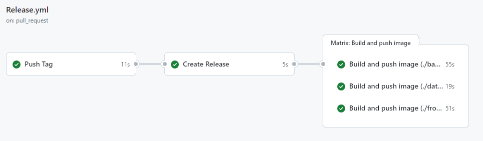
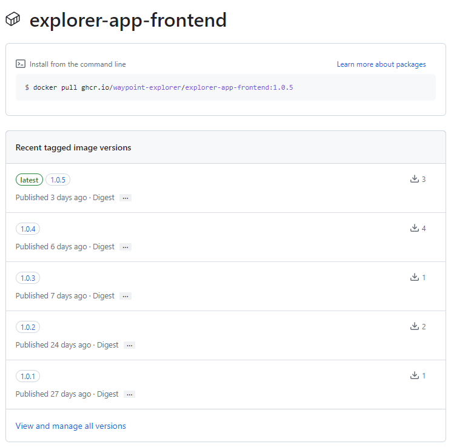
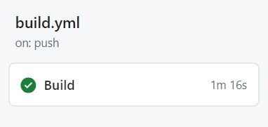
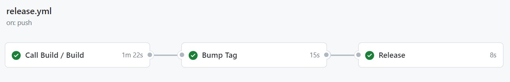

# Continuous Integration
Uno degli aspetti che sono stati presi in considerazione dalle prime fasi implementative è quello riguardante la Continuous Integration, un modo attraverso il quale il codice prodotto dai vari membri del team viene integrato regolarmente e automaticamente. Questo approccio si è dimostrato essenziale per ridurre in modo significativo i conflitti tra le diverse parti di software sviluppate in maniera indipendente dai membri del team, oltre a consentire rilasci frequenti di nuove funzionalità e alla tempestiva individuazione di eventuali errori su porzioni di codice più piccole e facilmente gestibili.\
Avendo strutturato lo sviluppo del sistema in maniera incrementale, questo risulta molto semplice da applicare, ottenendo inoltre preziosi feedback del sistema completo per valutarne lo stato complessivo e apportare miglioramenti.

## GitHub Actions
Nel corso dello sviluppo di questo progetto, sono state impiegate le *GitHub Actions* come strumento chiave per il processo di Continuous Integration. Questo ha consentito di automatizzare le attività, relative soprattutto alla pubblicazione della documentazione del progetto e al rilascio della web app e del software del device.

### Web App
Per la web app è stato realizzato un workflow con lo scopo di automatizzare il versionamento e il rilascio del codice. Il workflow si compone quindi di tre *jobs* da eseguire in maniera sequenziale che realizzano le seguenti funzioni:
1. *Push tag*: crea un nuovo *tag* che presenta il numero della versione del software seguendo i principi di *Semantic Versioning* spiegati precedentemente. Sfrutta la *GitHub Action* *anothrNick/github-tag-action* <a href="#1">[1]</a> per identificare nel messaggio della pull request che aggiunge il codice alla branch ```main``` un token che specifica il tipo di incremento del numero di versione da effettuare. Avendo sfruttato la convenzione già descritta in precedenza nella scrittura dei messaggi relativi ai vari commit, è stato possibile utilizzare il tipo di commit ```feat``` e ```fix``` per incrementare rispettivamente il numero di MINOR e PATCH;
2. *Create release*: crea una nuova release sfruttando il numero di versione generato dal *job* precedente, includendo tutto il codice sorgente relativo;
3. *Build and push image*: esegue parallelamente la build delle immagini docker del frontend, backend e database utilizzando il *Dockerfile* relativo a ciascuno dei tre componenti. Esso ha anche il compito di caricare il package risultate sul registry *ghcr.io*, associando ad ognuno di essi il numero di versione corretto.

Nelle immagini di <a href="#fig1">Figura 1</a> e <a href="#fig2">Figura 2</a> vengono ripresi il workflow per la release della web app e il risultato della pubblicazione dei package relativi al frontend dell'applicazione.

<div align="center">
    
    <p align="center" id="fig1">[Figura 1] Web App release workflow</p>
</div>

<div align="center">
    
    <p align="center" id="fig2">[Figura 2] Web App frontend package</p>
</div>

### Dispositivo
Per quanto riguarda il dispositivo, sono stati realizzati due workflow: il *Build*, per compilare il codice, e il *Release*, per creare una nuova release. Di seguito verrà spiegato in dettaglio il loro funzionamento.
#### Build
Questo workflow viene eseguito ogni volta che si effettua una *push* da branch diversi rispetto al ```main```. Ha la possibilità di essere chiamato da altri workflow. È necessario per le *Branch protection rules*, perchè viene utilizzata dallo `Require status checks to pass before merging` verso i branch ```main``` e ```dev```, in modo da poter fare il *merge* solo se la *build* viene completata con successo.\
Come illustrato in <a href="#fig3">Figura 3</a>, esso è composto da un singolo *job* che si occupa di:
- installare *Python* <a href="#2">[2]</a> e *PlatformIO* <a href="#3">[3]</a>;
- compilare il codice, scaricando tutte le dipendenze necessarie;
- archiviare il compilato come artefatto delle *GitHub Actions* per renderlo disponibile al download e condivisibile tra i *job*.

<div align="center">

<p align="center" id="fig3">[Figura 3] Build workflow</p>
</div>

#### Release
Questo workflow viene eseguito solamente quando viene fatta una *push* al branch ```main``` ed è mostrato in <a href="#fig4">Figura 4</a>. È necessario per rilasciare in automatico una nuova *release* ogni volta che viene effettuata una *push* a ```main```, come definito nel capitolo riguardante il workflow. \
I *job* che vengono eseguiti sono i seguenti:
1. *Call Build*: richiama il workflow di *Build*, precedentemente mostrato;
2. *Bump Tag*: dopo che è stato completato con successo il *job* di *Build*, si occupa della creazione del *tag*. Attraverso l'utilizzo della *Github Action* *anothrNick/github-tag-action* è stato possibile formattare in automatico il *tag* rispettando il *Semantic Versioning* utilizzato nel progetto;
3. *Release*: dopo che i *job* precedenti sono stati completati con successo, viene eseguita la release su *GitHub Release*. Questa è composta del *tag* precedentemente creato, l'artefatto caricato dal workflow di *Build* e il codice sorgente.

<div align="center">

<p align="center" id="fig4">[Figura 4] Release workflow</p>
</div>

## Riferimenti

<a id="1">[1]</a> github-tag-action, https://github.com/anothrNick/github-tag-action

<a id="2">[2]</a> Python, https://www.python.org

<a id="3">[3]</a> PlatformIO, https://platformio.org/
