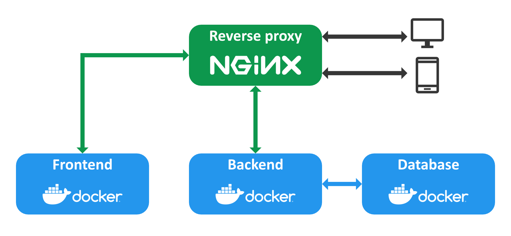

# Deployment
Come già scritto nella parte relativa all'architettura del sistema è stato considerato, sin dalle prime fasi progettuali, un eventuale deployment su larga scala.
Riprendendo quanto mostrato in Figura X, l’architettura per il deployment si
compone sempre dei tre macro componenti del sistema con l’aggiunta di un componente che funge da reverse proxy server per garantire il corretto accesso al sistema da client esterni. Questa è una architettura piuttosto diffusa nel mondo delle applicazioni web che può far fronte ad un discreto numero di utenti simultanei.

<div align="center">
    
    <p align="center">[Figura ] Architettura del sistema su server remoto</p>
</div>

La configurazione del reverse proxy server Nginx può essere effettuata nel seguente modo:

```
server {
    server_name waypoint-explorer.domain.com www.waypoint-explorer.domain.com;
    location / {
        proxy_pass http://localhost:3000;
        proxy_set_header Host $host;
        proxy_set_header X-Real-IP $remote_addr;
    }
    listen 443 ssl;
    ssl_certificate /etc/ssl_certificate.cer;
    ssl_certificate_key /etc/private_key.key;
}

server {
    server_name api-waypoint-explorer.domain.com www.api-waypoint-explorer.domain.com;
    location / {
        proxy_pass http://localhost:3001;
        proxy_set_header Host $host;
        proxy_set_header X-Real-IP $remote_addr;
    }
    listen 443 ssl;
    ssl_certificate /etc/ssl_certificate.cer;
    ssl_certificate_key /etc/private_key.key;
}
```

Nella configurazione sono stati aggiunti due server rispettivamente per il forntend e il backend utilizzando due domini diversi con i quali vengono effettuate le richieste dall'esterno ai rispettivi container docker presenti sul server remoto. In questo caso il mapping delle porte del server utilizza le porte ```3000``` e ```3001``` per il frontend e backend ma è possibile utilizzare una porta qualsiasi e configurare il mapping giusto nel file contenente le variabili d'ambiente di configurazione dei container docker.


Tenendo a mente che si tratta di un progetto pensato per essere realizzato all’interno di una singola amministrazione comunale, probabilmente un’architettura del genere potrebbe soddisfare in maniera adeguata il numero di utenti che potrebbero utilizzare il sistema. Inoltre, il deploy di questo sistema per un numero contenuto di utenti potrebbe essere effettuato mantenendo un costo molto limitato, considerando soprattutto l’ordine di grandezza del budget messo di solito a disposizione dalle amministrazioni comunali per progetti di questa natura.\
L’effettiva installazione del sistema potrebbe anche essere effettuata inizialmente su un elaboratore già in possesso dell’amministrazione comunale che, se pur con prestazioni ridotte, potrebbe garantire il funzionamento del sistema per una fase di testing iniziale, con un numero di utenti ridotto. Sicuramente, per un utilizzo più intensivo del sistema, sarebbe però indicata l’installazione su un VPS (Virtual Private Server) o l’uso di servizi di cloud computing dato che, questo approccio garantirebbe, a discapito di un costo maggiore, una serie di benefici molto importanti soprattutto in termini di scalabilità è disponibilità.

Oltre ai container Docker che realizzano i tre componenti principali del sistema durante il deploy è stato affiancato un ulteriore container Docker che utilizza un’immagine chiamata [Watchtower](https://containrrr.dev/watchtower/), la quale permette di aggiornare il sistema in maniera automatica controllando periodicamente se sono presenti nuove immagini aggiornate sul registry configurato. Questo permette di effettuare il deploy sul server remoto una sola volta e fornire automaticamente la versione più recente della web app senza bisogno, in condizioni normali, di alcun intervento esterno.


## Guida del progetto
### Web App
La web app è disponibile su GitHub al seguente link: [Repository Explorer App](https://github.com/Waypoint-Explorer/explorer-app).

> Sono necessari [Docker](https://www.docker.com/), [Docker Compose](https://docs.docker.com/compose/install/) (incluso nell'installazione di Docker Desktop) e un
[token Mapbox](https://www.docker.com/) valido

Per avviare la web app sono disponibili due opzioni:

#### Costruire e avviare il progetto
- Ottenere il codice sorgente
- Creare e compilare il file ```.env``` nella root della web app secondo quanto specificato nel template ```.env-template```
- Avviare il progetto utilizzando uno dei seguenti comandi:
    - ```docker-compose -f docker-compose.yml up --build --remove-orphans --detach```
    - ```npm start``` se si dispone di npm installato
#### Utilizzare l'ultima release delle immagini docker
- Ottenere il codice sorgente completo o il file ```docker-compose-auto.yml```
- Creare e compilare il file ```.env```  nella root della web app secondo quanto specificato nel template ```.env-template```
- Avviare il progetto utilizzando uno dei seguenti comandi:
    - ```docker-compose -f docker-compose-auto.yml up --build --remove-orphans --detach```
    - ```npm run deploy``` se si dispone di npm installato e del codice sorgente

### Device

Il codice del device è disponibile su GitHub al seguente link: [Repository Device](https://github.com/Waypoint-Explorer/device
)

#### Caricare il firmware nel dispositivo
> Sono necessari [Python 3.7 o superiore](https://www.python.org/downloads/) e [pip](https://pip.pypa.io/en/stable/installation/)

- Scaricare l'ultima versione del firmware `firmware-X.X.X.bin` dalla [repository](https://github.com/Waypoint-Explorer/device/releases)
- Aprire il terminale e scaricare `esptool` dal **PyPI** con il comando:
    ```
    pip install esptool
    ```
- Verificare l'installazione con:
    ```
    esptool.py -h
    ```
- Collegare il dispositivo alla porta USB del computer
- Caricare il firmware nel dispositivo utilizzando il comando seguente (cambiare il nome del file e la porta seriale):
    - Windows
        ```
        esptool.py --port COM4 --chip esp32 --baud 921600 --before default_reset --after hard_reset write_flash --compress --flash_mode dout 0x10000 firmware-X.X.X.bin
        ```
    - Linux
        ```
        esptool.py --port /dev/ttyUSB0 --chip esp32 --baud 921600 --before default_reset --after hard_reset write_flash --compress --flash_mode dout 0x10000 firmware-X.X.X.bin
        ```

