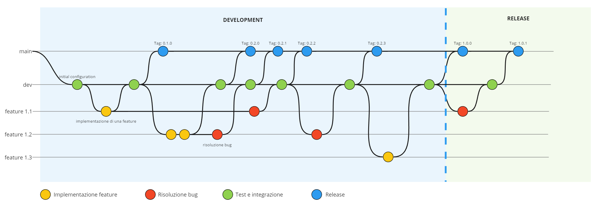

# Workflow

Il workflow scelto per gestire lo sviluppo continuo del software e il suo rilascio si ispira al modello di *Gitflow*, incorporando alcune delle sue caratteristiche principali ma senza adottarne completamente l'approccio.

*Gitflow* prevede l'uso di due branch principali, ```master``` e ```develop```, che servono rispettivamente per mantenere le versioni stabili rilasciate del software e per il suo sviluppo.\
Da ```develop``` vengono poi creati dei branch specifici per l'implementazione di nuove funzionalità o per miglioramenti del codice, i quali rimangono attivi solamente per il tempo necessario allo sviluppo della feature richiesta.\
Prima del rilascio ufficiale di una versione stabile del codice, si creano dei branch di release a partire dal codice presente in ```develop```, nei quali vengono effettuati test e correzioni prima della pubblicazione.\
Nel caso in cui alcuni bug o problemi non vengano individuati durante il controllo effettuato nei branch di release, finendo così nel codice rilasciato, vengono utilizzati dei branch di hotfix a partire da ```master```, con lo scopo di correggere il difetto e apportare le modifiche necessarie sia su ```master``` che su ```develop```.

Nel contesto di questo progetto, il workflow utilizzato presenta analogie con il modello *Gitflow*, includendo due branch principali chiamati ```main``` e ```dev```. Anche in questo caso, essi rappresentano rispettivamente il codice considerato rilasciato e stabile e il codice utilizzato per lo sviluppo. Similarmente a *Gitflow*, sono stati utilizzati branch distinti per ciascuna feature implementata a partire dal codice presente su ```dev```, così da consentire a ciascun membro del team di lavorare autonomamente su una specifica funzionalità, per poi unire il codice su ```dev``` una volta completato lo sviluppo.\
Generalmente, il lavoro eseguito su un feature branch è pensato per essere completato da un solo sviluppatore nel corso di un breve periodo, che solitamente richiede poche ore o al massimo pochi giorni lavorativi, a seconda della complessità delle feature stesse. In particolare, per questo progetto, è stato deciso di creare un feature branch per ogni requisito funzionale di secondo livello. Più nello specifico, per ogni funzionalità individuata durante la fase di analisi dei requisiti, sono stati individuati dei task che implementano un aspetto parziale della macro funzionalità e, per ciascuno di questi task, è stato creato un branch specifico per l'implementazione.

Tuttavia, l'approccio adottato presenta alcune differenze dal modello *Gitflow*. Ad esempio, non è stato utilizzato un branch specifico per le release, eseguendo piuttosto i test finali direttamente su ```dev``` prima di spostare il codice su ```main``` per il rilascio ufficiale.\
Inoltre, sono state apportate modifiche riguardo agli hotfix: invece di creare branch separati per risolvere i bug, gli errori sono stati risolti direttamente nelle feature branch correlate alle funzionalità coinvolte, mantenendo così coerenza e continuità nel lavoro su ciascuna specifica feature.

Nella <a href="#fig1">Figura 1</a>, viene presentato in modo sintetico il workflow concordato dal team di sviluppo, includendo diversi possibili scenari che potrebbero verificarsi durante l'implementazione del sistema.

<div align="center">
    
    <p align="center" id="fig1">[Figura 1] Workflow del progetto</p>
</div>

## Software Versioning
Durante lo sviluppo di questo progetto, è stato adottato il *Semantic Versioning* (SemVer v2) per etichettare le diverse versioni del software rilasciato. Ciascuna versione del codice è stata numerata secondo la convenzione **MAJOR.MINOR.PATCH**, in cui il numero di PATCH rappresenta il rilascio delle correzioni di bug, il numero di MINOR indica il rilascio di nuove funzionalità compatibili, mentre il numero di MAJOR segnala cambiamenti radicali che potrebbero comportare incompatibilità con versioni precedenti.

Tuttavia, nell'assegnare un numero di versione al codice del progetto, ci si è focalizzati maggiormente sulle funzionalità implementate rispetto all'interfaccia presente nel codice. Questa scelta è motivata dal fatto che, in questo specifico contesto, collegare strettamente il numero di versione al codice non avrebbe fornito una chiara tracciabilità dei cambiamenti effettuati. Di conseguenza, si è voluto porre maggior attenzione sulle funzionalità implementate per rendere più intuitivo lo stato del progetto.\
Nello specifico, è stato utilizzato il numero di PATCH per tracciare bug fix o modifiche che non aggiungono nuove funzionalità. Il numero di MINOR è stato adottato per tenere traccia dell'implementazione delle task presenti nei requisiti funzionali, aggiungendo così funzionalità per gli utenti del sistema. Infine, il numero di MAJOR è stato usato per indicare cambiamenti importanti nella storia del progetto.

Durante lo sviluppo, mentre il numero di PATCH e MINOR avevano un riscontro ben chiaro nel codice o nella documentazione di esso, il numero di MAJOR è stato utilizzato solamente per indicare la conclusione dello sviluppo di tutti i requisiti concordati. Qualora il sistema cambi in modo radicale in futuro, comportando modifiche importanti alle sue funzionalità, questo verrebbe comunicato attraverso un incremento del numero MAJOR.

## Convenzione dei Commit
Il team di sviluppo ha inoltre adottato l'approccio descritto da *Conventional Commits* <a href="#1">[1]</a>. Questa scelta è stata presa sia per rendere facilmente automatizzabile l'incremento del numero di versione, sia per rendere più chiaro lo scopo del codice introdotto durante i commit. Tale obiettivo è stato conseguito strutturando il messaggio di commit secondo il seguente formato: ```<type>[optional scope]: <description>```. Ciascun commit, oltre a includere una descrizione completa di quanto implementato e opzionalmente un riferimento alla porzione del progetto coinvolta nelle modifiche, è anche contrassegnato da un tipo (selezionato tra un elenco di opzioni sotto riportate), ognuna con un significato specifico.\
I tipi di commit utilizzati in questo progetto sono i seguenti:

- **chore**: modifiche generiche che non aggiungono funzionalità;
- **feat**: aggiunta di una nuova feature;
- **fix**: risoluzione di un bug o incorrettezza generica;
- **ci**: modifiche relative alla continous integration del progetto;
- **docs**: modifiche che riguardano la documentazione del progetto.

## Repository
Con l'obiettivo di gestire in modo più strutturato e completo l'intero progetto, è stata creata un'organizzazione su *GitHub*, denominata "Waypoint Explorer". Così facendo, è stato possibile suddividere il codice in varie repository, ciascuna delle quali è focalizzata su specifiche parti del progetto. In particolare, sono state create tre repository: una dedicata alla web app, una al dispositivo, una a questa documentazione del progetto. Questa suddivisione ha favorito una maggiore indipendenza nel corso dello sviluppo e il mantenimento di confini ben definiti tra le varie parti relative ad aspetti differenti del progetto.

## Riferimenti

<a id="1">[1]</a> Conventional Commits, https://www.conventionalcommits.org/en/v1.0.0/

