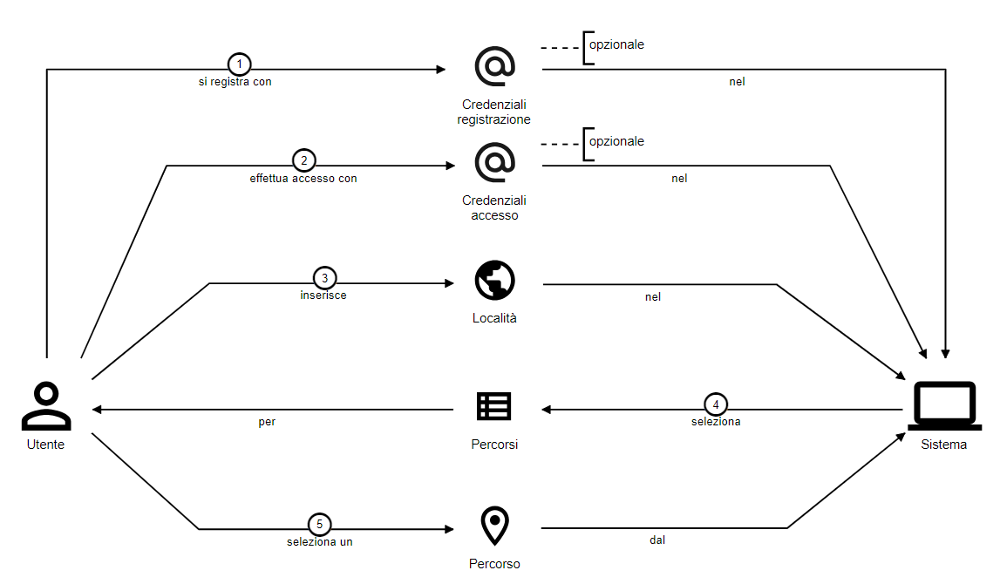
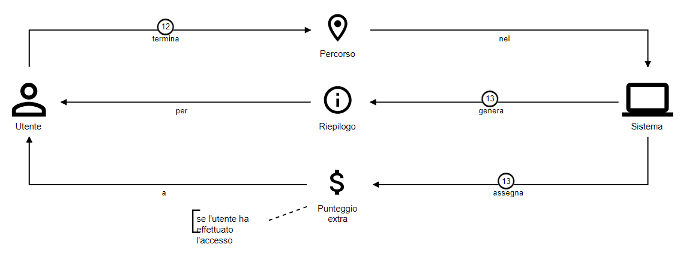
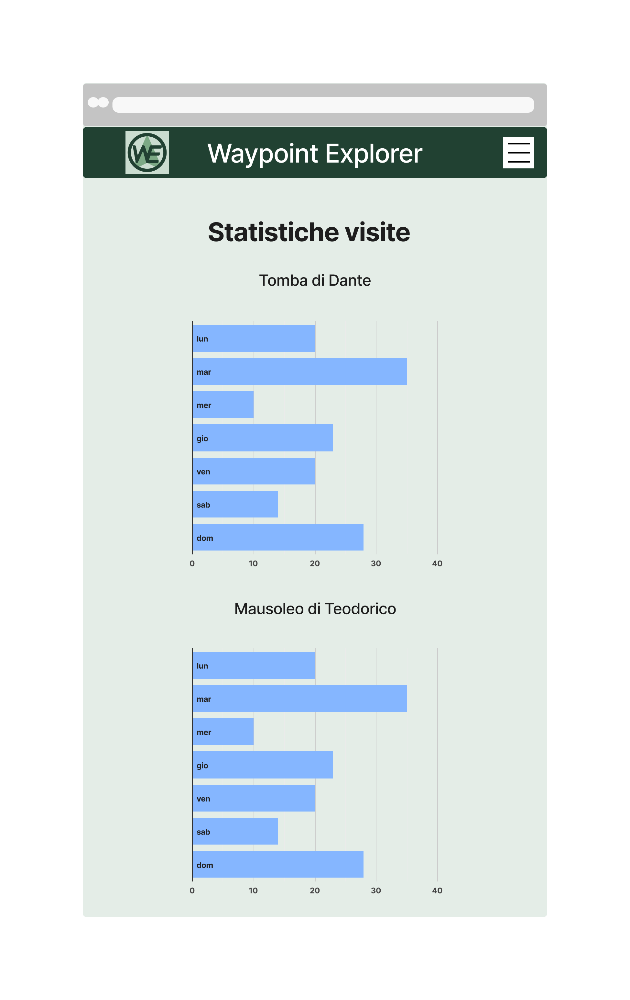

# Knowledge Crunching
## Intervista con il committente

{: .highlight }
Ciao, sono un dipendete del Comune di Ravenna e mi occupo di turismo e rilancio del territorio. Grazie al Piano Nazionale di Ripresa e Resilienza (PNRR), sono stati stanziati dei fondi per la "Digitalizzazione, Innovazione, Competitività, Cultura" e noi abbiamo deciso di utilizzarli per un progetto nell'ambito di "Approccio digitale per il rilancio di turismo e cultura". Il nostro obiettivo è quello di incentivare la visita dei punti di interesse turistici, culturali e naturalistici, promuovendo al tempo stesso lo sviluppo del territorio e l'attività fisica all'aria aperta.\
Esso si inserisce in un contesto in cui, dopo il periodo di Covid, sono tornati i turisti esteri a visitare il nostro Paese e anche noi italiani abbiamo ricominciato a vagare per i nostri territori. Contemporaneamente, a causa del cambiamento climatico in corso e alla sensibilizzazione effettuata nella popolazione mondiale, tutti i cittadini hanno una consapevolezza maggiore e si cerca di incentivare l'utilizzo di mezzi non inquinanti (come bicicletta o skateboard), sostenibili (quali i monopattini elettrici) o mezzi pubblici di trasporto (ad esempio gli autobus). Ancora meglio per la salute e l'ambiente sarebbe spostarsi a piedi, unendo così l'attività fisica all'aria aperta.\
Durante una riunione preliminare nella nostra area, è emerso che potremmo creare dei percorsi che toccano vari punti di interesse, come ad esempio musei, monumenti, sentieri, panorami, piazze, con lo scopo di rendere piacevole, divertente e stimolante la visita del territorio.\
In più, vorremmo incentivare l'acquisto nei negozi locali, quindi dobbiamo pensare ad un modo per aggiungere questo obiettivo al progetto. Ad esempio, pensavamo di accordarci con gli esercenti locali di fornire degli sconti a chi utilizza il sistema. Questo potrebbe incentivare ancora di più l'uso sistema.

---

**Analista**: "Cosa intendete come percorso?"\
**Esperto del dominio**: "Un percorso è un itinerario composto da varie tappe. Ogni tappa coincide con un punto di interesse del territorio."

**Analista**: "Cosa si intendete per punto di interesse?"\
**Esperto del dominio**: "Un punto di interesse è tutto ciò che detiene un valore significativo per l'amministrazione comunale, tanto da volerlo promuovere come meta di visita: musei, monumenti, piazze, edifici rilevanti, punti panoramici, sentieri, parchi, etc."

**Analista**: "Chi e come crea i percorsi?"\
**Esperto del dominio**: "Il Comune si occuperà di decidere quali sono i punti di interesse all'interno del proprio territorio che corrispondono alle tappe dei percorsi. Utilizzando le tappe inserite nel sistema, il Comune può creare dei percorsi suddivisi in categorie che verranno suggeriti ai visitatori, ad esempio percorsi culturali, tematici e naturalistici."

**Analista**: "Il visitatore dovrà necessariamente seguire per intero un percorso? Potrà interromperlo prima della fine? Potrà visitare altri punti di interesse che non sono all'interno del percorso scelto?"\
**Esperto del dominio**: "No, l'utente potrà scegliere di effettuare solo una parte del percorso scelto, cioè può terminarlo in qualsiasi momento. In più, se dovesse scegliere di aggiungere altre tappe che non sono incluse nel percorso, può farlo liberamente e poi continuare con il percorso scelto inizialmente."

**Analista**: "Quante tappe ci possono essere in un percorso?"\
**Esperto del dominio**: "In un percorso ci deve essere almeno una tappa, ma non c'è un limite massimo. Nel caso in cui ci siano più tappe in un percorso, queste non hanno un ordine preciso da rispettare."

**Analista**: "Come far navigare un utente tra le varie tappe di un percorso?"\
**Esperto del dominio**: "Ci sarà una mappa che mostra i punti di interesse e un itinerario consigliato, ma l'utente è libero di scegliere il tragitto che ritiene più opportuno."

**Analista**: "Con quali mezzi di trasporto ci si può spostare tra i vari punti di interesse?"\
**Esperto del dominio**: "Come accennato in precedenza, vogliamo incentivare l'attività fisica o comunque in generale il trasporto sostenibile. Per questo motivo vorremmo che l'utente si spostino a piedi, con mezzi di mobilità attiva (biciletta, skateboard, rollerblade), mezzi di micro mobilità elettrica (monopattini elettrici, biciclette a pedalata assistita, hoverboard e segway) o al massimo con i mezzi pubblici di trasporto."

**Analista**: "Cosa succede quando un utente termina un percorso?"\
**Esperto del dominio**: "Il visitatore visualizza un riepilogo del percorso appena concluso. Vorremmo che gli utenti registrati possano visualizzare anche a posteriori i percorsi effettuati con le relative informazioni."

**Analista**: "Quindi consideriamo che ci possano essere sia utenti registrati che non?"\
**Esperto del dominio**: "Chiunque può utilizzare alcune funzionalità del sistema, cioè visualizzare ed effettuare i percorsi. Se però un utente si registra, ha a disposizione più funzionalità e vantaggi: lo storico dei percorsi e gli sconti. Per la registrazione, bastano username, città di residenza, Stato, anno di nascita, indirizzo e-mail e password di accesso."

**Analista**: "Dato che ha accennato all'incentivare l'acquisto nei negozi locali e sconti, questi ultimi con quale criterio vengono rilasciati?"\
**Esperto del dominio**: "L'utente accumula un certo numero di punti predeterminato per ogni tappa che visita e, completando interamente il percorso, ottiene punti extra. Per incentivarlo a visitare luoghi meno conosciuti o più lontani, questi punti di interesse potrebbero avere un punteggio maggiore. L'utente può utilizzare i punti accumulati per sbloccare dei coupon di sconto per una serie di attività commerciali e per luoghi culturali a pagamento presenti sul territorio. Inoltre in futuro si potrebbe pensare di creare per gli esercenti un'area dedicata del sistema per gestire i coupon. Un ulteriore sviluppo potrebbe essere quello di introdurre dei coupon speciali per gli utenti iscritti da più tempo o che hanno completato un certo numero di percorsi. Infine si potrebbe aggiungere una scadenza sia per il riscatto che per l'utilizzo."

**Analista**: "Come pensavate di far accumulare i punti all'utente e come può ottenere i coupon?"\
**Esperto del dominio**: "Dopo che l'utente si è registrato, il sistema memorizza automaticamente il punteggio ottenuto, così che possa visualizzarlo e convertirlo in coupon validi per un singolo utilizzo."

**Analista**: "Visto che ogni tappa rilascia dei punti ai visitatori, avete pensato a come volete controllare che l'utente visiti veramente un punto di interesse?"\
**Esperto del dominio**: "Sì, abbiamo pensato che in ogni luogo si potrebbe installare qualcosa per verificare che l'utente sia veramente passato da quella tappa. Avete in mente delle possibili soluzioni?"\
**Analista**: "Si potrebbe posizionare un codice QR in ogni punto di interesse e, quando l'utente lo scansiona, viene registrato il suo passaggio."

**Esperto del dominio**: "Ora che ne stiamo parlando, sarebbe utile lato amministrativo poter monitorare il numero di visitatori per ogni tappa in un determinato lasso di tempo. In più, essendoci monumenti ad elevato rischio di usura causata dalle condizioni ambientali, c'è per caso modo di installare delle stazioni metereologiche nelle loro vicinanze?"\
**Analista**: "Potremmo pensare ad una soluzione che integri delle stazioni metereologiche e un display per il codice QR. In questo modo, potremmo generare un codice QR personalizzato per ogni visitatore per evitare che lo riutilizzino per accumulare punti senza veramente visitare la tappa. Avete già delle stazioni metereologiche a disposizione?"\
**Esperto del dominio**: "Non ne abbiamo di preesistenti. Riuscite ad occuparvene voi?"\
**Analista**: "Certamente. Possiamo creare dei dispositivi che uniscono diversi sensori ambientali al display. Avete necessità di alcune misurazioni specifiche?"\
**Esperto del dominio**: "Ci interesserebbe ottenere informazioni riguardanti temperatura, umidità, pressione atmosferica e qualità dell'aria. Con questi dati sarebbe utile in futuro poter elaborare un sistema, magari attraverso l'utilizzo di intelligenza artificiale, per rilevare e notificare le condizioni dei monumenti nelle vicinanze del dispositivo, oppure decidere il percorso prediligendo le tappe con condizioni ambientali migliori."

**Analista**: "Tutti i punti di interesse scelti dal Comune, hanno una copertura di rete e una fonte di alimentazione per la stazione metereologica?"\
**Esperto del dominio**: "Purtroppo non possiamo assicurare queste caratteristiche, perché alcuni punti di interesse potrebbero trovarsi lontano dai centri abitati e/o immerso nella natura."

**Analista**: "Quindi per ogni tappa deve essere presente un dispositivo o possono esserci altri modi per identificare una tappa?"\
**Esperto del dominio**: "Potrebbero esserci dei semplici codici QR stampati, tuttavia, considerando la necessità di un codice univoco per ogni visita al fine di evitare la riutilizzazione dei codici e l'ottenimento dei punti senza effettuare la visita, è possibile ipotizzare che le tappe che utilizzano un QR code stampato non assegnino punti agli utenti."

**Analista**: "Ora che abbiamo definito le caratteristiche generali, come vi immaginate il progetto?"\
**Esperto del dominio**: "Pensavamo ad una applicazione del cellulare o ad un sito, visto che gli utenti devono poter utilizzare il servizio da smartphone all'esterno in giro per il territorio. Riassumendo quanto detto fino ad ora, il visitatore deve poter selezionare un percorso, vedere i punti di interesse sulla mappa per potersi orientare, scansionare il codice QR in ogni tappa, utilizzare i punti ottenuti per poter ricevere i coupon di sconto. L'amministrazione comunale deve poter monitorare la frequenza delle visite dei luoghi di interesse, le condizioni ambientali rilevate sul proprio territorio e lo stato delle stazioni metereologiche stesse."

## Diagrammi dei casi d'uso
A seguito dell'intervista con il committente e delle domande specifiche su alcuni aspetti, sono stati prodotti dei diagrammi dei casi d'uso. Essi hanno aiutato a schematizzare e rendere più chiaro quello che ogni attore del sistema deve poter fare. Essi rappresentano le necessità e le aspettative degli utenti rispetto a come desiderano che il sistema si comporti o quali scopi desiderano che il sistema raggiunga.

Nel diagramma in <a href="#fig1">Figura 1</a> sono rappresentati sia i casi d'uso di un utente guest, cioè non autenticato, che quelli dell'utente registrato:
- utente guest:
  - visualizza tutta lista dei possibili percorsi
  - seleziona un percorso tra quelli visualizzati
  - arrivato ad una tappa, scansiona il relativo codice QR
  - effettua registrazione inserendo i propri dati
  - effettua login inserendo le proprie credenziali di accesso
- utente registrato:
  - visualizza tutta lista dei possibili percorsi
  - seleziona un percorso tra quelli visualizzati
  - arrivato ad una tappa, scansiona il relativo codice QR
  - converte in coupon sconto i punti accumulati completando i percorsi
  - visualizza storico percorsi effettuati in precedenza

[Figura 1] Diagramma dei casi d’uso: utente

Nel diagramma in <a href="#fig2">Figura 2</a> sono rappresentati i casi d'uso che riguardano l'area amministrativa del sistema:
- utente guest:
  - effettua il login per entrare nell'area riservata dell'amministrazione
- amministrazione comunale:
  - visualizza le informazioni relative allo stato e al funzionamento dei dispositivi (sensori e display)
  - visualizza le statistiche riguardanti le visite dei punti di interesse nel territorio
  - gestisce percorsi che comprendono una o più tappe
  - gestisce i coupon degli sconti, cioè inserisce dei possibili coupon da riscattare e decide quanti punti assegnare per ogni tappa
  - visualizza i dati sulle condizioni ambientali rilevati dai sensori

[Figura 2] Diagramma dei casi d’uso: amministrazione comunale

Nel diagramma in <a href="#fig3">Figura 3</a> sono rappresentati i casi d'uso relativi ai sensori utilizzati nel sistema di rilevamento e ai display:
- sensore:
  - raccoglie i dati ambientali effettuando le misurazioni
- display:
  - mostra il codice QR relativo ad una determinata tappa

[Figura 3] Diagramma dei casi d’uso: dispositivo

## Domain storytelling
A seguito della lunga intervista effettuata con l'esperto del dominio e successivamente alla creazione degli schemi dei casi d'uso, sono stati approfonditi i concetti insieme al committente. Utilizzando la strategia del domain storytelling, sono stati realizzati i seguenti diagrammi per
acquisire una completa comprensione dell'interazione degli utilizzatori con il sistema e il dispositivo, nonché dell'interazione del dispositivo stesso con i sensori e il display.

Gli utenti hanno la possibilità di registrarsi o accedere al sistema. Tuttavia, questi passaggi non sono obbligatori per interagire con la mappa. Anche un utente guest può selezionare una località, visualizzare i percorsi disponibili in quella zona e sceglierne uno per avviare l'esplorazione, come schematizzato in <a href="#fig4">Figura 4</a>.

In seguito, una volta raggiunta una tappa indicata nell'applicazione, l'utente interagisce con un marcatore intelligente situato nelle vicinanze del punto di interesse. Premendo un pulsante, il dispositivo genera un codice QR che viene mostrato su un piccolo display e successivamente scansionato dall'utente tramite l'applicazione. In questo modo, il sistema registra il passaggio alla tappa e, se l'utente ha effettuato l'accesso gli viene assegnato il punteggio corrispondente al punto di interesse appena visitato (<a href="#fig5">Figura 5</a>). Entrando più nel dettaglio del dispositivo, come si può notare da <a href="#fig7">Figura 7</a>, una volta che avviene l'interazione con il visitatore, il codice QR generato dal dispositivo contiene anche i dati ambientali rilevati dai sensori.

Una volta completato il percorso, all'utente viene mostrato un riepilogo delle tappe visitate e altre informazioni sull'itinerario appena concluso. Successivamente, se l'utente ha effettuato l'accesso e ha scelto un percorso di particolare rilevanza, gli verranno assegnati ulteriori punti bonus, come da <a href="#fig6">Figura 6</a>.

[Figura 4] Interazione dell'utente con il sistema per registrazione, accesso e visualizzazione mappa con percorsi

[Figura 5] Interazione dell'utente con il sistema per validare il passaggio da una tappa

[Figura 6] Interazione dell'utente con il sistema per visualizzare il riepilogo al termine di un percorso

[Figura 7] Interazione dell'utente con il dispositivo e del dispositivo con i propri sensori e display

Se l'utente ha effettuato l'accesso, può accedere a funzionalità aggiuntive, come la visualizzazione dello storico dei percorsi completati (<a href="#fig8">Figura 8</a>) e la possibilità di convertire i punti accumulati durante i percorsi in coupon sconto (<a href="#fig9">Figura 9</a>).

[Figura 8] Interazione dell'utente con il sistema per visualizzare lo storico dei percorsi

[Figura 9] Interazione dell'utente con il sistema per convertire i punti in coupon

L'area dell'amministrazione comunale è visibile solo dopo aver effettuato l'accesso. E' stato scelto di non permettere la registrazione dall'interfaccia utente comune, bensì le credenziali verranno fornite direttamente dai tecnici di competenza.

L'amministrazione si occupa della creazione dei percorsi che vengono suggeriti agli utenti, aggiungendo tappe e relativi marcatori (come da <a href="#fig10">Figura 10</a>). In più, essa può aggiungere coupon sconto donati dagli esercenti del territorio, come schematizzato in <a href="#fig11">Figura 11</a>.

[Figura 10] Interazione dell'amministrazione con il sistema per inserire marcatori, tappe e percorsi e associarli rispettivamente

[Figura 11] Interazione dell'amministrazione con il sistema per l'inserimento di coupon

Nell'area amministrazione è possibile richiedere i dati ambientali del territorio, quelli rilevati dai sensori del dispositivo e le informazioni sullo stato dei device (<a href="#fig12">Figura 12</a> e <a href="#fig13">Figura 13</a>).

[Figura 12] Interazione dell'amministrazione con il sistema per la visualizzazione dei dati ambientali

[Figura 13] Interazione dell'amministrazione con il sistema per la visualizzazione delle informazioni sui dispositivi

Infine, l'amministrazione comunale può visualizzare le statistiche relative alle visite, in particolare al numero di percorsi effettuati in un determinato periodo di tempo (<a href="#fig14">Figura 14</a>).

[Figura 14] Interazione dell'amministrazione con il sistema per la visualizzazione delle statistiche sui percorsi visitati

## Mock-up
Con lo scopo di avere un'idea più chiara della suddivisione in interfacce delle varie funzionalità richieste e della loro disposizione grafica, insieme al committente sono stati ideati i mockup sotto riportati.

Come da <a href="#fig15">Figura 15</a>, le informazioni generali sul progetto, una breve guida utente e un pulsante per iniziare l'esplorazione sono tutte presenti nella pagina iniziale. Attraverso l'interazione con il bottone o tramite menu laterale, ci si sposta nella pagina di navigazione (<a href="#fig16">Figura 16</a>). In questo punto, può essere scelto il percorso da iniziare tra quelli proposti, aiutandosi con un filtro per categorie di itinerario. La mappa aiuta nella visualizzazione grafica del percorso stesso e delle tappe che lo compongono.

[Figura 15] Pagina iniziale

[Figura 16] Pagina navigazione utente

Dal lato amministrativo, un dipendente comunale incaricato ha la possibilità di inserire nuovi marcatori nel sistema, che possono essere dispositivi fisici o codici QR stampati. Inoltre, è possibile creare tappe associate a un determinato marcatore e percorsi che comprendono una o più tappe. Questi elementi e le loro relative informazioni possono essere aggiunti in un'unica pagina, come in <a href="#fig17">Figura 17</a>. Per quanto riguarda le statistiche, è presente una schermata (come <a href="#fig18">Figura 18</a>) con istogrammi per la visualizzazione del numero di percorsi effettuati dagli utenti in un determinato periodo di tempo.

[Figura 17] Pagina amministrazione per inserimento marcatori, tappe, percorsi

[Figura 18] Pagina statistiche amministrazione

Infine, sono state create due interfacce dedicate alla registrazione di nuovi esploratori (<a href="#fig19">Figura 19</a>) e all'accesso al sistema da parte degli utenti o degli amministratori (<a href="#fig20">Figura 20</a>). Queste sono visibili solo quando l'applicazione è in modalità utente ospite, ovvero quando nessun utente ha effettuato l'accesso.

[Figura 19] Pagina registrazione utente

[Figura 20] Pagina accesso utente e amministrazione

