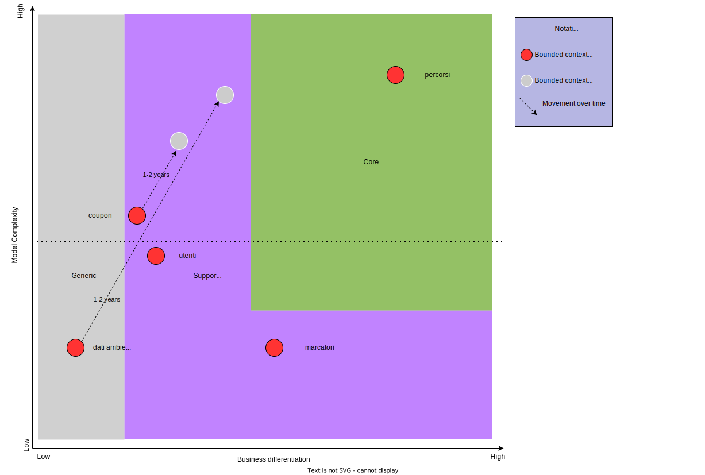

# Sottodomini
I sottodomini hanno il ruolo di suddivisione e organizzare le varie parti che compongono il progetto. Essi rappresentano aree specifiche di funzionalità, ognuna con il proprio scopo e compito distintivo per permettere un miglioramento nell'efficienza durante lo sviluppo e la manutenzione. In particolare, sono stati individuati i seguenti sottodomini che compongono il nostro progetto e che contribuiscono alla realizzazione delle parti fondamentali del sistema complessivo:
- **percorsi**: si occupa della creazione dei percorsi, aggiunta di tappe ad un percorso, creazione delle tappe, aggiunta di un marcatore ad una tappa, esecuzione di un percorso;
  
- **marcatori**: si occupa dell'inserimento nel sistema dei marcatori e della loro gestione nel mondo fisico nelle operazioni di rilevazione tramite sensori e controllo del funzionamento corretto del dispositivo;

- **coupon**: si occupa dell'aggiunta di nuovi coupon e del riscatto dei coupon da parte degli esploratori;

- **utenti**: si occupa della registrazione di un nuovo utente esploratore, gestione dello storico degli utenti esploratori, accesso degli utenti esploratori e amministratori;

- **dati ambientali**: gestisce i dati ambientali riguardanti un'area geografica, includendo l'aggiunta nel sistema e le attività di analisi dei dati.

[Figura 1] Core Domain Chart

Per i sottodomini individuati è stato realizzato il *Core Domain Chart* mostrato in <a href="#fig1">Figura 1</a> il quale mostra come i sottodomini si posizionano rispetto ai due fattori di "business value" e "complessità del modello del dominio".
Il "business value" si riferisce al valore distintivo che un determinato aspetto del progetto porta rispetto agli altri, indica quindi cosa rende l'azienda unica e attraente per i suoi clienti o utenti. La "complessità del modello del dominio" riflette quanto sia complesso il sistema sottostante che gestisce e rappresenta i concetti incorporati nel sottodominio considerato.
I sottodomini identificati sono quindi stati disposti nel *Core Domain Chart* come specificato di seguito:

- **percorsi**: costituisce il nucleo fondamentale del progetto, noto come _decisive core domain_, poiché ospita le funzionalità fondamentali che definiscono il progetto nel suo complesso, rendendolo unico. Questo sottodominio si occupa di ogni aspetto relativo ai percorsi nel territorio. Esso include la creazione di nuovi itinerari, comprese le tappe che li compongono. Inoltre, esso si occupa anche della gestione dell'esplorazione effettuata da utenti guest ed esploratori, comprese le fasi di inizio e conclusione di un percorso. Considerata la sua posizione di primaria rilevanza, questo sottodominio interagisce in modo diretto o indiretto con tutti gli altri sottodomini del progetto e, attraverso un'interfaccia utente, con gli utilizzatori del sistema;

- **marcatori**: è responsabile per la gestione integrale dei marcatori nell'ambiente fisico e per la loro corrispondenza all'interno del sistema. In particolare, gestisce i dispositivi che acquisiscono dati dall'ambiente circostante e generano codici QR visualizzabili dagli utenti. Pur costituendo un aspetto distintivo del progetto, non sono di carattere essenziale. Di conseguenza, il sottodominio rientra nella categoria dei _supporting domain_;
  
- **coupon**: considerato come _supporting domain_, dal momento che rende possibile la gestione dei coupon all'interno del sistema: dall'aggiunta di nuovi coupon nel sistema da parte dell'amministratore, al riscatto di un coupon da parte di un esploratore. 
Alla luce delle prospettive future delineate dal committente, è stato valutato che entro 1-2 anni il sottodominio potrebbe acquisire maggiore complessità e valore commerciale, pur mantenendo la sua natura di _supporting domain_. Questo scenario potrebbe manifestarsi attraverso l'introduzione di coupon speciali ottenibili solo da specifici tipi di esploratori (coloro che sono iscritti da un certo numero di anni o che hanno completato un certo numero di percorsi). Inoltre, si potrebbe considerare l'implementazione di coupon con scadenza, sia in termini di offerta da riscattare entro una data specifica, sia per quanto riguarda l'uso dei coupon già riscattati, che potrebbero essere validi in un determinato intervallo temporale. In un'ottica ancora più avanzata, potrebbe essere presa in considerazione un'evoluzione che consenta agli esercenti di accedere direttamente a un'area dedicata del sistema, dove possono inserire offerte di coupon sconto e accedere a statistiche pertinenti;

- **utenti**: questo sottodominio è stato classificato come _supporting_, poiché si focalizza sulle funzionalità basilari legate agli utenti. Queste funzionalità sono principalmente quelle che riguardano l'autenticazione dell'utente: dalla registrazione in qualità di esploratore fino all'accesso al sistema, sia in veste di esploratore che di amministratore, includendo anche il controllo della sessione. Inoltre, questo sottodominio si occupa della gestione dello storico dei percorsi, ovvero il sistema conserva traccia di tutti gli itinerari completati da un esploratore, inclusi i punti di interesse visitati;
  
- **dati ambientali**: comprende il semplice inserimento nel sistema dei dati ambientali, precedentemente rilevati dai marcatori, oltre a limitate attività di analisi su queste informazioni. Il sottodominio ha una bassa complessità e non è di fondamentale importanza per il business, in quanto non costituisce un aspetto innovativo del progetto. Date queste caratteristiche di semplicità, esso è considerato un _generic domain_. Tuttavia, considerando le prospettive future emerse durante l'incontro iniziale con il committente, è previsto che questo sottodominio crescerà significativamente in complessità e rilevanza all'interno del progetto.\
Si prevede infatti l'introduzione di componenti di notevole innovazione, come l'utilizzo di intelligenza artificiale per capire le condizioni dei monumenti o punti di interesse, suggerendo manutenzioni o azioni correttive. In più, si potrebbero consigliare o modificare i percorsi di utenti guest ed esploratori in base alle condizioni ambientali rilevate in tempo reale (ad esempio, evitare tappe in zone colpite da temporali o proporre percorsi fitness con una migliore qualità dell'aria). Di conseguenza, è probabile che diventi un _supporting domain_ nel corso di 1-2 anni.
