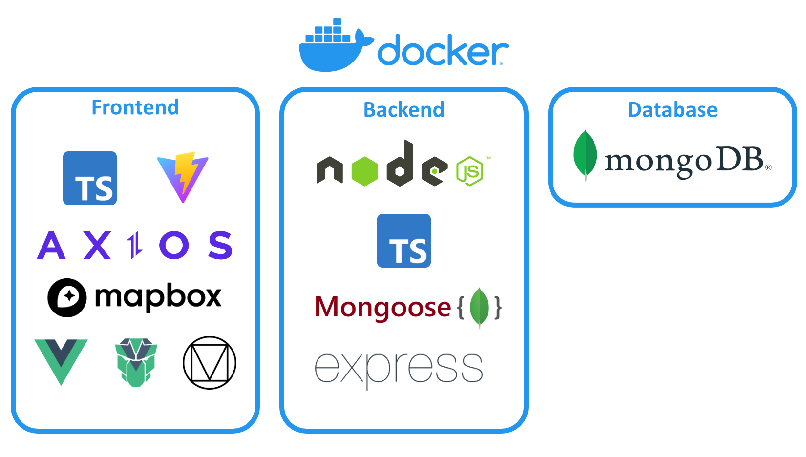
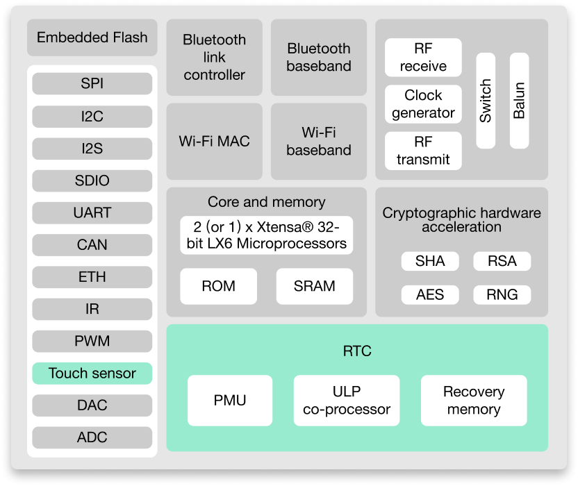
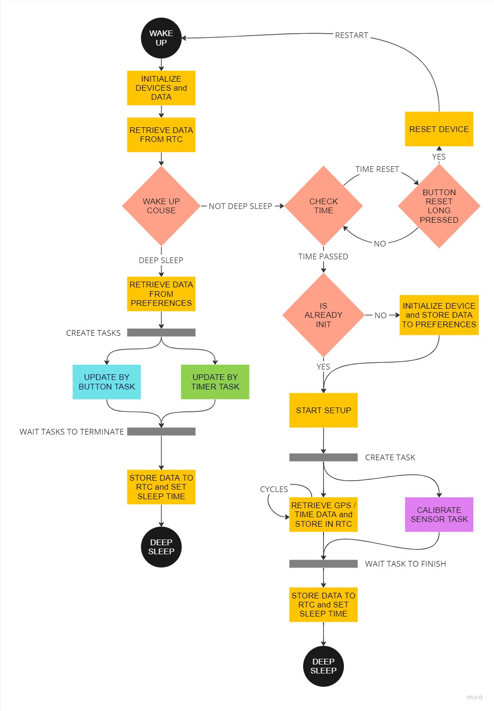
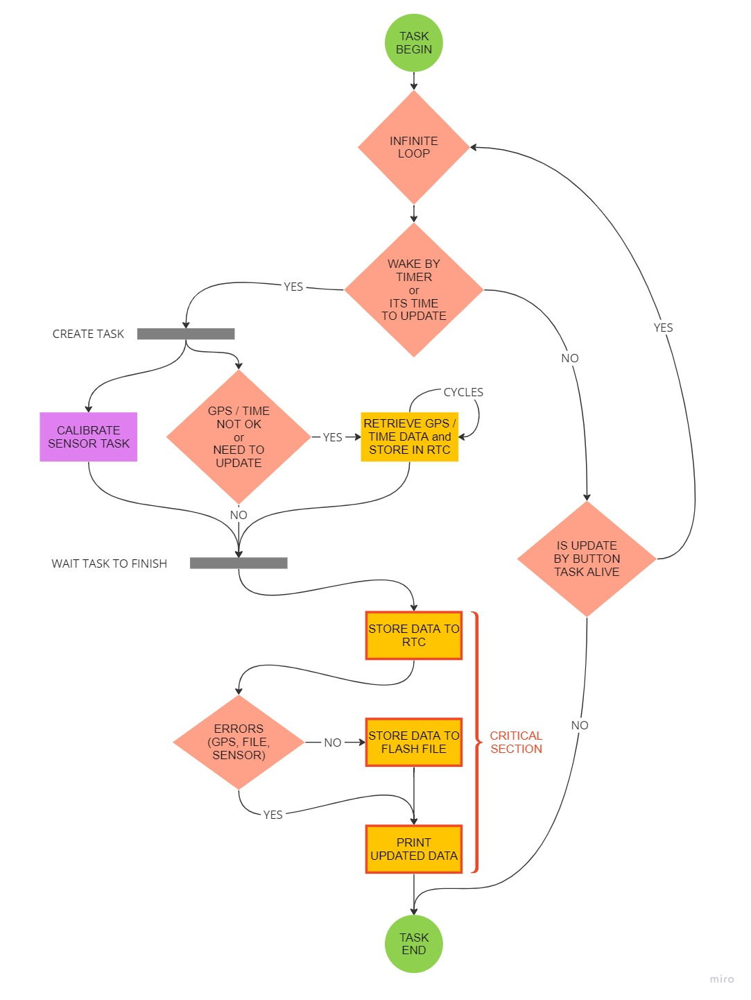
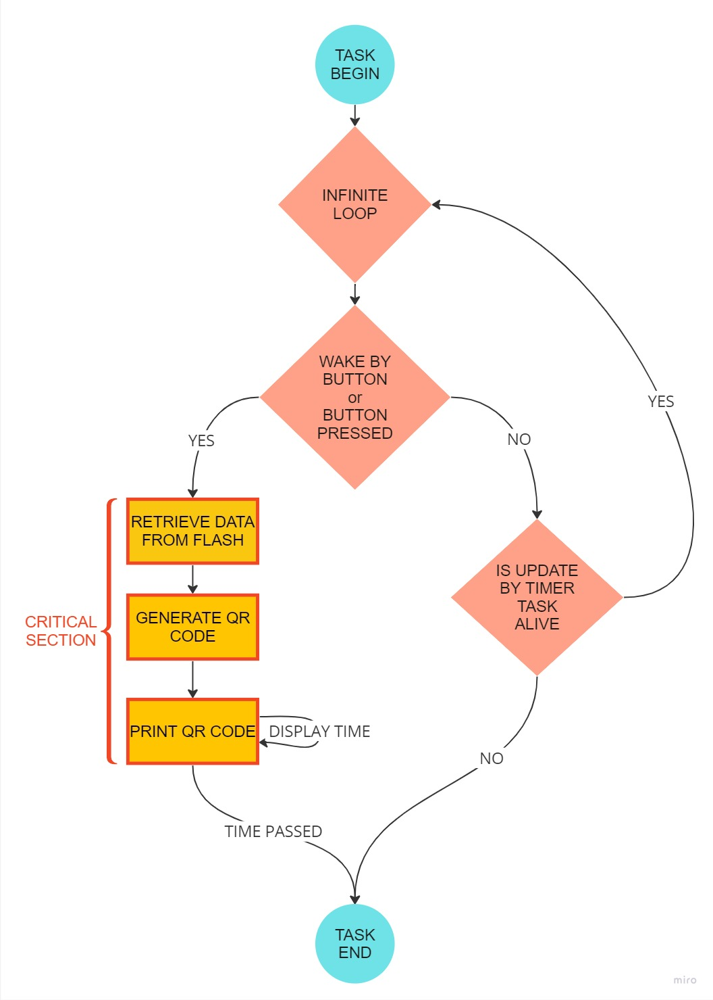
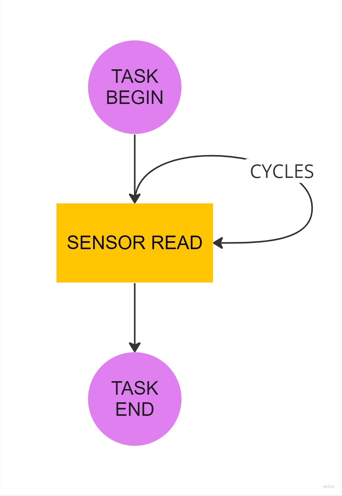

# Implementazione

## Web App
Per la realizzazione della web app, progettata per l’interazione degli utenti (siano
essi guest, esploratori o amministratori), sono state utilizzate numerose tecnologie già presenti sul mercato. L’obiettivo era selezionare la soluzione più adatta
per ciascuna tecnologia, considerando i requisiti del progetto, la qualità, la diffusione/popolarità della tecnologia e le competenze pregresse degli sviluppatori.\
L’immagine di <a href="#fig1">Figura 1</a> riassume le tecnologie più importanti che sono state utilizzate per i tre componenti principali sviluppati. Per ciascuna di esse verranno
fornite motivazioni della scelta, come sono state utilizzate e cosa hanno permesso
di realizzare all’interno di questo sistema.

<div align="center">
    
    <p align="center" id="fig1">[Figura 1] Tecnologie principali utilizzate nella web app</p>
</div>

La prima tecnologia utilizzata nell’implementazione del sistema è stata *Docker* che sin da subito ha permesso, a seguito di una fase iniziale di configurazione, di semplificare lo sviluppo del sistema, permettendo ad ogni sviluppatore di avviare le proprie istanze dei tre componenti senza dover installare ripetutamente ogni componente o libreria esterna utilizzata. La scelta di *Docker* in particolare è stata effettuata in quanto è sicuramente una delle tecnologie più famose nel suo ambito e sono disponibili inoltre diversi registry nel quale caricare e trovare alcune immagini *Docker* già preimpostate per diversi utilizzi. Ad esempio, per l’istanza relativa al database è stata utilizzata l’immagine *mongo:4* che ha permesso di utilizzare un database *MongoDB* semplicemente con delle minime configurazioni iniziali.\
Come già accennato in precedenza, è stato deciso di utilizzare lo stack di tecnologie MEVN, considerata una delle tre principali scelte nello sviluppo di web app moderne. Lo stack MEVN si compone di quattro tecnologie:

- MongoDB <a href="#1">[1]</a> - un database non relazionale, orientato ai documenti, ampiamente utilizzato per gestire grandi quantità di dati in modo flessibile e scalabile. La sua architettura senza schema consente di memorizzare e recuperare dati in formato JSON-like, offrendo flessibilità nella struttura dei documenti. *MongoDB* supporta operazioni di lettura/scrittura ad alte prestazioni e offre inoltre alcune funzionalità avanzate per garantire la disponibilità e la scalabilità del sistema. Grazie alla sua natura distribuita, *MongoDB* è in grado di gestire carichi di lavoro ad alta concorrenza e di supportare quindi applicazioni moderne che richiedono una gestione efficiente dei dati;

- Express <a href="#2">[2]</a> - un framework web per *Node.js* che semplifica lo sviluppo di applicazioni web e API. E’ basato sul concetto di middleware rendendolo quindi modulare aggiungendo funzionalità attraverso l’uso di middleware personalizzati o di terze parti ed offre un modo semplice ed efficiente per gestire richieste e risposte HTTP. Express supporta la gestione delle route, la gestione dei parametri delle richieste, la gestione delle sessioni e molto altro. Express è una teconolgia notevolmente diffusa nell’ambito web vista la sua ampia gamma di funzionalità per costruire applicazioni web scalabili e performanti. E’ stato scelto dal team di sviluppo sia per le sue prestazioni che per le esperienze positive riscontrate durante lo sviluppo di progetti precedenti;

- Vue.js <a href="#3">[3]</a> - un framework *JavaScript* che permette la creazione di interfacce utente dinamiche e reattive. Oltre ad avere una sintassi piuttosto semplice, uno dei suoi aspetti fondamentali è la possibilità di creare componenti modulari e riutilizzabili per creare applicazioni web complesse in modo efficiente. *Vue* utilizza un approccio reattivo che consente di gestire ed aggiornare dinamicamente l’interfaccia grafica a seguito di input dell’utente o cambiamenti dei dati che rappresentano lo stato dell’applicazione. Inoltre, *Vue* permette la realizzazione di web app a pagina singola (single page application), ovvero la realizzazione dell’intera applicazione web all’interno della stessa pagina evitando il caricamento durante la navigazione tra le varie pagine. Questo garantisce un’esperienza più fluida da parte dell’utente con un minore tempo di risposta a seguito del primo caricamento iniziale. Per quanto riguarda il frontend di una applicazione web, *Vue* è sicuramente uno dei framework più utilizzati e la sua scelta è stata sia dovuta alle sue prestazioni e semplicità sia in quanto già utilizzato dal team di sviluppo in passato;

- Node.js <a href="#4">[4]</a> - un runtime environmente *JavaScript* pensato principalmente per eseguire codice *JavaScript* lato server dove in passato venivano utilizzati altri linguaggi lasciando l’utilizzo *JavaScript* per l’esecuzione del codice nei client. *Node.js* offre quindi un ambiente di esecuzione per server scalabile e ad alte prestazioni, utilizzando un modello asincrono basato sugli eventi che consente di gestire un elevato numero di richieste simultaneamente. Questo lo rende particolarmente indicato per applicazioni web che necessitano di tempi di risposta brevi ed è in assoluto una delle tecnologie più utilizzate nello sviluppo web moderno.

Un esempio di utilizzo di queste tecnologie per quanto riguarda il sistema è sicuramente la gestione delle informazioni relative al dominio dell’applicazione. Nel seguente listato è riportato un estratto semplificato dello schema di un waypoint utilizzato durante l’inizializzazione del database *MongoDB* per indicare lo schema dei documenti che verranno inseriti.

```js
const waypoint_schema = {
    bsonType: "object",
    required: ["_id", "name"],
    properties: {
        _id : {
            bsonType: "objectId",
            description: "The id of this waypoint in the database",
        } ,
        name: {
            bsonType : "string",
            description : "The name of this waypoint",
        } ,
        description: {
            bsonType: "string",
            description: "The description of this waypoint",
        } ,
        marker: {
            bsonType: "objectId",
            description: "The marker id related to this waypoint",
        },
    },
};
```

A questo schema presente nel database corrisponde uno schema equivalente definito
nel componente del backend modellato attraverso l’utilizzo di *Mongoose* <a href="#5">[5]</a>, una libreria di modellazione degli oggetti per *Node.js*. Nel listato sottostante è presente la modellazione nel backend dello stesso schema che è stato appena mostrato. In questo modo, viene semplificata la gestione dei dati ed è possibile effettuare query per la creazione, lettura e aggiornamento dei dati usufruendo anche di funzionalità di validazione dei dati rispetto agli schemi definiti.

```js
/** Models a waypoint */
interface Waypoint {
    /** The id of this waypoint */
    _id: MongooseTypes.ObjectId,
    /** The name of this waypoint */
    name: string,
    /** The description of this waypoint */
    description?: string,
    /** The id of the marker bound with this waypoint */
    marker?: MongooseTypes.ObjectId,
}

/** Schema for a waypoint */
const WAYPOINT_SCHEMA = new Schema<Waypoint>({
    name: { type: SchemaTypes.String, required: true },
    description: { type: SchemaTypes.String, required: false },
    marker: { type: SchemaTypes.ObjectId, required: false },
});
```

Utilizzando in maniera congiunta *Express* e *Mongoose* è possibile strutturare dei gestori delle query nel seguente modo:

```js
public static readonly findById : RequestHandler = (req: Request, res: Response) => {
    ExplorerAppDatabase.Singleton.Waypoints.findOne({
        _id: new Types.ObjectId(req.params.waypointId)}, {}).exec()
        .then(sendJson(req, res), sendError(req, res));
}
```

Nell’esempio precedente è presente l’handler che viene utilizzato quando viene effettuata una delle route gestite tramite *Express*, che in questo caso corrisponde all’estrazione di uno dei waypoint tramite il suo identificativo:

```js
express.Router().get("/waypoints/id/:waypointId", WaypointsQueryHandlers.findById)
```

Qui di seguito vengono elencate le route messe a disposizione dal backend del sistema, indicando solamente il tipo di richiesta, la route e gli eventuali query parameters.

```js
get("/users")
get("/users/:userId")
post("/users")
patch("/users/:userId")

post("/login")
get("/logout")

get("/completed-itineraries")
get("/completed-itineraries/id/:completedItineraryId")
get("/completed-itineraries/user/:userId")
post("/completed-itineraries")
patch("/completed-itineraries/update/:completedItineraryId")
patch("/completed-itineraries/stop/:completedItineraryId")

get("/itineraries")
get("/itineraries/id/:itineraryId")
get("/itinerariesTypes")
post("/itineraries")

get("/waypoints")
get("/waypoints/id/:waypointId")
post("/waypoints")

get("/markers")
get("/markers/id/:markerId")
get("/markers/marker-id/:markerId")
get("/markerTypes")
post("/markers")

get("/measures")
post("/measures")

get("/coupons")
post("/coupons")

get("/redeemed-coupons")
get("/redeemed-coupons/id/:redeemedCouponId")
get("/redeemed-coupons/user/:userId")
post("/redeemed-coupons")
```

L’effettivo reperimento ed utilizzo dei dati nel frontend dell’applicazione viene effettuato tramite la libreria *Axios* <a href="#6">[6]</a>, la quale permette in modo semplice di effettuare delle richieste *HTTP* e comunicare quindi con un server attraverso la sua *API*. *Axios* utilizza le Promise o chiamate async per permettere la computazione asincrona quando si riceve eventualmente la risposta dal server di backend. Ne è un esempio la seguente richiesta, che viene utilizzata per ottenere dal backend tutti i waypoint inseriti nel database. A seguito di una risposta del server è poi possibile utilizzare nel frontend i dati, restituiti direttamente in un formato *JSON-like*, per esempio mostrare tutte le tappe disponibili nel sistema.

```js
axios.get("http://${Environment.BACKEND_HOST}/waypoints").then((response) => {
    const waypoints = response.data;
}) ;
```

Una delle caratteristiche principali di questa applicazione è permettere la navigazione degli utenti tra le tappe dei percorsi inseriti dall’amministrazione comunale, ed è per questo che si è pensato di utilizzare delle librerie per la visualizzazione di una mappa, senza la quale il sistema sarebbe stato di difficile utilizzo per gli utenti finali. A tale scopo è stato scelto di utilizzare *Mapbox* <a href="#7">[7]</a>, una piattaforma di mappe che fornisce sia una libreria che permette la visualizzazione delle mappe nella propria web app sia servizi di fornitura di mappe interattive e personalizzabili. Attraverso *Mapbox* è possibile creare una mappa che presenti le informazioni e uno stile personalizzato dallo sviluppatore. In questo caso, è stato creato uno stile su misura che fosse privo quanto più possibile da elementi non inerenti per questo progetto (come ristoranti, altre attività commerciali, etc.) lasciando solamente punti di interesse generale della città (piazze, monumenti, parchi, etc.).\
Una volta configurato *Mapbox*, esso restituisce direttamente le map tile (ovvero porzioni di mappa caricate dinamicamente) che presentano lo stile e le informazioni configurate. Attraverso la libreria messa a disposizione è poi semplice integrare un visualizzatore di questa mappa nel codice della propria interfaccia grafica.\
Come già detto, per la realizzazione dell’interfaccia grafica è stato utilizzato il framework *Vue*, ma esso è stato espanso grazie all’utilizzo di *PrimeVue* <a href="#8">[8]</a>, una libreria di componenti pronti all’uso che permettono la realizzazione di un’interfaccia con uno stile moderno, reattivo e di alta qualità. Proprio per questo motivo, essa è utilizzata da molti sviluppatori per la realizzazione di applicazioni web ed è stato deciso di utilizzarla vista la conoscenza da parte del team di sviluppo.

Per quanto riguarda la scelta dei colori dell’applicazione e l’aspetto generale di essa, sono stati seguiti quanto più possibile i principi espressi da *Material Design* <a href="#9">[9]</a> e *Typescale* <a href="#10">[10]</a> che esprimono linee guida e principi per la creazione di interfacce utente intuitive, coerenti e coinvolgenti. Ad esempio, tutte le icone utilizzate provengono dalla libreria di *Material Design* e la spaziatura degli elementi segue la regola dei terzi minore, considerata un buono standard per la realizzazione di interfacce sia mobile che desktop.

## Dispositivo
L'implementazione del dispositivo comprende due parti, l'hardware e il firmware. Di seguito verranno spiegate e motivate le scelte di utilizzo.

### Hardware
Per quanto riguarda la parte fisica del progetto, dopo una attenta analisi dei requisiti e la fase di progettazione, si è deciso di utilizzare i seguenti componenti:

- **ESP32**: un microcontrollore potente e a basso costo, realizzato dalla *Espressif Systems*, che ha la possibilità di essere programmato in *C++* tramite la libreria di Arduino. Uno dei motivi per cui è stato scelto è che ha la possibilità di entrare in diverse modalità di risparmio energetico. Quella che interessa questo progetto è la modalità *Deep Sleep* <a href="#11">[11]</a>, che mantiene attive solo alcune periferiche, come mostrato in <a href="fig2">Figura 2</a>. In questo modo, quando il dispositivo non è in uso, il consumo energetico è estremamente ridotto, raggiungendo valori dell'ordine dei microampere (uA).

<div align="center">
    
    <p align="center" id="fig2">[Figura 2] Architettura dell'ESP32 che mostra i componenti attivi durante la modalità di Deep Sleep (evidenziato in ciano)</p>
</div>

- **CJMCU-680**: per quanto riguarda i dati ambientali si è deciso di adottare questo modulo che monta un sensore **BME680** <a href="#12">[12]</a> prodotto da Bosch Sensortec. È molto versatile perché permette la comunicazione sia I2C che SPI, oltre ad essere di piccole dimensioni ha un prezzo contenuto ed è completo di rilevatore di temperatura, di umidità, di pressione e di qualità dell'aria.

- **E-Paper Display**: vista la necessità di dover risparmiare il più possibile energia e di dover mostrare costantemente delle informazioni, un normale display (es. LCD) non è consigliabile. Per questo è stato scelto un display di tipo Eletronic Paper che mantiene il suo stato anche senza essere alimentato.

### Firmware

Per quanto riguarda l'implementazione del firmware del dispositivo sono state utilizzate principalmente le seguenti tecnologie native dell'ESP32:

- **Multitasking**: fornito dal *ESP-IDF FreeRTOS* <a href="#13">[13]</a>, che ha permesso la creazione di più task concorrenti con la possibilità di legarli a core differenti, come riportato di seguito:
    ```cpp
    xTaskCreatePinnedToCore(updateByTimer, "updateByTimerTask", UPDATE_BY_TIMER_TASK_WORDS, NULL, UPDATE_BY_TIMER_TASK_PRIORITY, &UpdateByTimerTask, CORE_1);

    xTaskCreatePinnedToCore(updateByButton, "updateByButtonTask", UPDATE_BY_BUTTON_TASK_WORDS, NULL, UPDATE_BY_BUTTON_TASK_PRIORITY, &UpdateByButtonTask, CORE_0);
    ```
    In questo modo due o più operazioni che dovrebbero essere eseguite sequenzialmente vengono eseguite in parallelo, riducendo notevolmente il tempo complessivo e rendendo il dispositivo più usabile per gli utenti.

- **Deep Sleep**: attraverso l'utilizzo di questa tecnologia è stato possibile ottimizzare al massimo il consumo energetico, aumentando notevolmente la durata della carica della batteria e quindi riducendo la necessità di manutenzione. Ci sono diverse modalità con cui si può svegliare il dispositivo dalla *Deep Sleep*. Quelle usate per questo progetto sono la sveglia tramite timer e la sveglia tramite pulsante, come mostrato di seguito.
    ```cpp
    // Wake up by timer
    esp_sleep_enable_timer_wakeup(TIME_TO_SLEEP);

    // Wake up by button pressed
    esp_sleep_enable_ext0_wakeup(UPDATE_BUTTON, HIGH);

    // Start Deep Sleep
    esp_deep_sleep_start();
    ```

    Un'altra funzione fondamentale è stata:
    ```cpp
    // Reason of device wakeup
    wakeupCause = esp_sleep_get_wakeup_cause()
    ```
    che permette il riconoscimento della causa che ha svegliato il dispositivo.

- **RTC**: timer interno all'ESP32 che mantiene le sue funzioni anche quando il dispositivo è in *Deep Sleep*. Inoltre possiede una piccola memoria da 8K che permette di salvare variabili che normalmente andrebbero perse. Di seguito un esempio di variabile salvata nella memoria RTC.
    ```cpp
    // Var stored in RTC memory
    RTC_DATA_ATTR uint8_t countGpsRead;
    ```

#### Diagrammi a blocchi
Di seguito verranno riportati i diagrammi che descrivono il funzionamento complessivo del sistema.

- **Main**

    Nell'immagine sotto riportata (<a href="#fig3">Figura 3</a>) si può vedere il diagramma che descrive il *Main*, nonché il flusso principale del dispositivo.\
    All'avvio, nella prima fase inizializza le variabili, ottiene i dati dalla memoria RTC e controlla se il dispositivo è stato svegliato dalla *Deep Sleep*.\
    Se non lo è, nei primi secondi controlla se viene premuto a lungo il tasto di reset, e nel caso cancella tutti i dati salvati nella flash e riavvia il dispositivo.\
    Se non viene premuto, allora fa la prima inizializzazione, genera l'id univoco del dispositivo, salva  le informazioni in memoria. Successivamente, cerca di ottenere i dati dal GPS e contemporaneamente genera il task che calibra il sensore. Infine salva tutto in memoria RTC e imposta il prossimo timer del *Deep Sleep*.\
    Se invece è stato svegliato dalla *Deep Sleep*, legge i dati salvati nella memoria non volatile, genera i due task *UpdateByTimer* e *UpdateByButton*, e attende la loro conclusione.
    Una volta terminati salva tutti i nuovi dati ottenuti in memoria RTC e imposta il prossimo timer del *Deep Sleep*.

<div align="center">
    
    <p align="center" id="fig3">[Figura 3] Main</p>
</div>

 - **Update By Timer**

    Nell'immagine sotto riportata (<a href="#fig4">Figura 4</a>) si può vedere il diagramma che descrive il task *Update By Timer*, nonché il processo che si occupa dell'aggiornamento periodico dei dati ambientali.\
    Nella prima fase controlla se la causa per cui il dispositivo è stato svegliato dalla *Deep Sleep* è il timer o è già sveglio ed è il momento di aggiornare i dati.
    Se così, genera il task di calibrazione del sensore (*CalibrateSensor*) e parallelamente controlla se è necessario ottenere data e ora aggiornati dal GPS.\
    Una volta atteso la fine del task, salva i nuovi dati ambientali in memoria RTC e se non ci sono errori salva i dati nella memoria non volatile, in ogni caso stampa a schermo i dati rilevati.\
    Nel caso il dispositivo non sia stato svegliato dalla *Deep Sleep* o non sia ancora il momento di aggiornare i dati, continua in loop finchè anche l'altro task parallelo non è terminato *Update By Button* e termina anche'esso.

<div align="center">
    
    <p align="center" id="fig4">[Figura 4] Task Update By Timer</p>
</div>

- **Update By Button**

    Nell'immagine sotto riportata (<a href="#fig5">Figura 5</a>) si può vedere il diagramma del task *Update By Button*, che si occupa di gestire la pressione del pulsante e la generazione del codice QR.\
    Similmente al task precedente, controlla se il dispositivo è stato svegliato dalla *Deep Sleep* tramite pulsante o se già sveglio e il pulsante è stato premuto.\
    Nel caso della pressione del pulsante il dispositivo, prima legge i dati dalla sua memoria non volatile, poi genera il codice QR contenente la stringa di dati. E infine stampa il codice QR a schermo, che rimane visibile per un certo periodo tempo e infine termina.\
    Nel caso invece che il dispositivo non sia stato svegliato dalla *Deep Sleep* o che non sia premuto il pulsante, continua in loop finché anche il task *Deep Sleep* non è terminato e termina anch'esso.

<div align="center">
    
    <p align="center" id="fig5">[Figura 5] Task Update By Button</p>
</div>

- **Calibrate Sensor**

    Il task mostrato nella <a href="#fig6">Figura 6</a> è molto semplice e si occupa della calibrazione del sensore.
    Non è altro che un ciclo finito per fare in modo che il rilevatore di gas si calibri e questo appunto necessita un determinato numero di letture.

<div align="center">
    
    <p align="center" id="fig6">[Figura 6] Task Calibrate Sensor</p>
</div>

#### Librerie utilizzate
Per lo sviluppo del codice sono state utilizzate diverse librerie per agevolare l'utilizzo dei vari componenti:
- **SPIFFS**: utilizzata per gestire lo *SPIFFS* (Serial Peripheral Interface Flash File System) che permette la gestioni di file nella memoria non volatile (Flash);
 - **Preferences**: utilizzata per salvare in memoria non volatile (Flash) delle variabili che devono rimanere memorizzate anche in caso di un riavvio o di mancata alimentazione;
 - **BSEC Arduino library**: utilizzata per gestire il sensore *BME680*;
 - **QRCodeGenerator**: utilizzata per generare il codice QR;
 - **ArduinoJson**: utilizzata insieme a *SPIFFS* per serializzare e deserializzare i dati in file JSON;
 - **ESPTrueRandom**: utilizzata per generare numeri casuali necessari per la generazione dell'id del dispositivo;
 - **ESP32Time**: utilizzata per semplificare il salvataggio e l'ottenimento del tempo gestito dall'ESP32;
 - **TinyGSM**: utilizzata per gestire il *GPS*, con cui si ottengono data, ora e coordinate geografiche;
 - **minigrafx**: utilizzata per mostrare a schermo le informazioni che devono essere visualizzate dall'utente.

## Riferimenti

<a id="1">[1]</a> MongoDB, https://www.mongodb.com/it-it

<a id="2">[2]</a> Express, https://expressjs.com/it/

<a id="3">[3]</a> Vue.js, https://vuejs.org/

<a id="4">[4]</a> Node.js, https://nodejs.org/en

<a id="5">[5]</a> Mongoose, https://mongoosejs.com/

<a id="6">[6]</a> Axios, https://axios-http.com/docs/intro

<a id="7">[7]</a> Mapbox, https://www.mapbox.com/

<a id="8">[8]</a> PrimeVue, https://primevue.org/

<a id="9">[9]</a> Material Design 2, https://m2.material.io/design

<a id="10">[10]</a> Typescale, https://typescale.com/

<a id="11">[11]</a> Sleep modes, https://docs.espressif.com/projects/esp-idf/en/latest/esp32/api-reference/system/sleep_modes.html

<a id="12">[12]</a> BME680, https://www.bosch-sensortec.com/products/environmental-sensors/gas-sensors/bme680/

<a id="13">[13]</a> ESP-IDF FreeRTOS, https://docs.espressif.com/projects/esp-idf/en/latest/esp32/api-reference/system/freertos.html