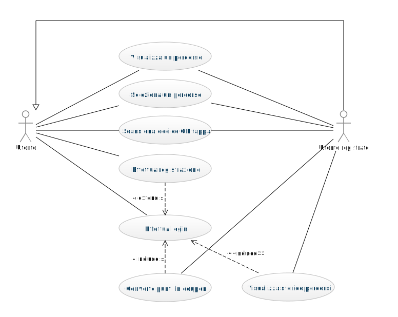
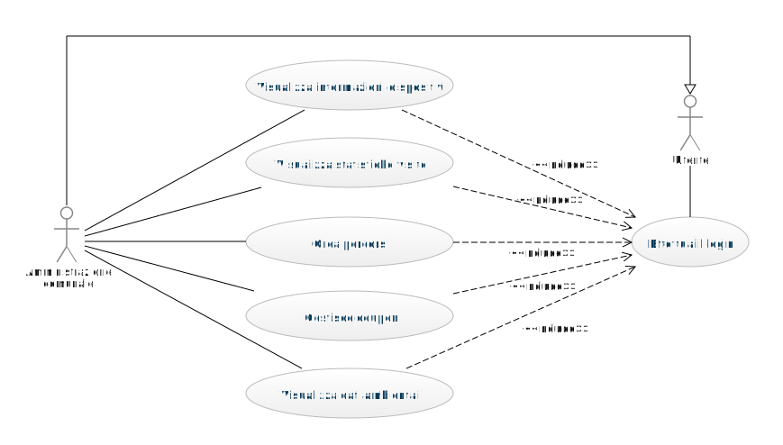
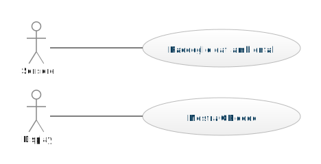

# Waypoint Explorer

## Introduzione

Waypoint Explorer è un progetto nato per incentivare la visita dei punti di interesse turistici, culturali e naturalistici attraverso percorsi, con l'obiettivo di promuovere lo sviluppo del territorio e l'esercizio fisico all'aria aperta.

Il sistema prevede l'installazione di dispositivi in corrispondenza dei punti di interesse che si incontrano lungo il percorso. Questi dispositivi sono dotati di sensori in grado di rilevare le condizioni ambientali e mostrano un codice QR univoco che deve essere scansionato per poter procedere alla tappa successiva. I dispositivi sono progettati per funzionare in modo autonomo e con un basso consumo energetico, utilizzando eventualmente una batteria e un pannello solare. I percorsi saranno percorribili solamente a piedi, in bicicletta o con mezzi sostenibili come i monopattini elettrici, incentivando l'uso di mezzi di trasporto a basso impatto ambientale. Completando i percorsi, gli utenti saranno premiati con buoni sconto per incentivare l'uso del sistema e sostenere le attività locali.

Inoltre, l'amministrazione comunale avrà la possibilità di raccogliere informazioni sul territorio attraverso i sensori dei dispositivi, fornendo dati utili per la gestione dell'area e la pianificazione delle attività turistiche. Grazie alla sua scalabilità e alla sua flessibilità, il sistema potrà essere facilmente esteso e adattato alle esigenze specifiche di ogni territorio.

Daniele Gambaletta - daniele.gambaletta@studio.unibo.it - 0000924643\
Riccardo Omiccioli - riccardo.omiccioli@studio.unibo.it - 0001054475\
Cecilia Teodorani - cecilia.teodorani@studio.unibo.it - 0001032918

---

## Analisi del Dominio
La prima attività che è stata svolta durante lo sviluppo del progetto è l'analisi del dominio in cui si inserisce il progetto. Questa comprende un incontro con il committente, che ci si è immaginati il Comune di Ravenna. Inizialmente, la persona preposta dell'amministarazione comunale ha esposto l'idea generale del progetto e successivamente sono state effettuate delle domande e osservazioni per comprendere al meglio le esigenze. Durante la fase di analisi sono stati prodotti dei documenti per comprendere al meglio le esigenze.

### Knowledge Crunching
#### Intervista con il committente
"Ciao, sono un dipendete del Comune di Ravenna, mi occupo di ... . Grazie al Piano Nazionale di Ripresa e Resilienza (PNRR), sono stati stanziati dei fondi per la "Digitalizzazione, Innovazione, Competitività, Cultura" e noi abbiamo deciso di utilizzarli per un progetto nell'ambito di "Approccio digitale per il rilancio di turismo e cultura". Il nostro obiettivo è quello di incentivare la visita dei punti di interesse turistici, culturali e naturalistici, promuovendo al tempo stesso lo sviluppo del territorio e l'attività fisica all'aria aperta.\
Esso si inserisce in un contesto in cui, dopo il periodo di Covid, sono tornati i turisti esteri a visitare il nostro Paese e anche noi italiani abbiamo ricominciato a vagare per i nostri territori. Contemporaneamente, a causa del cambiamento climatico in corso e alla sensibilizzazione effettuata nella popolazione mondiale, tutti i cittadini hanno una consapevolezza maggiore e si cerca di incentivare l'utilizzo di mezzi non inquinanti (come bicicletta o skateboard), sostenibili (quali i monopattini elettrici) o mezzi pubblici di trasporto (ad esempio gli autobus). Ancora meglio per la salute e l'ambiente sarebbe spostarsi a piedi, unendo così l'attività fisica all'aria aperta.\
Durante una riunione preliminare nella nostra area, è emerso che potremmo creare dei percorsi che toccano vari punti di interesse, come ad esempio musei, monumenti, sentieri, panorami, piazze, con lo scopo di rendere piacevole, divertente e stimolante la visita del territorio.\
In più, vorremmo incentivare l'acquisto nei negozi locali, quindi dobbiamo pensare ad un modo per aggiungere questo obiettivo al progetto. Ad esempio, pensavamo di accordarci con gli esercenti locali di fornire degli sconti a chi utilizza il sistema. Questo potrebbe incentivare ancora di più l'uso sistema."

---
Analista: "Cosa intendete come percorso?"\
Esperto del Dominio: "Un percorso è un itenerario composto da varie tappe. Ogni tappa si colloca in un punto di interesse del territorio."

Analista: "Cosa si intendete per punto di interesse?"\
Esperto del Dominio: "Un punto di interesse è tutto ciò che può interessare ad un visitatore: musei, monumenti, piazze, edifici rilvenati, punti panoramici, sentieri, parchi, etc."

Analista: "Chi e come crea i percorsi?"\
Esperto del Dominio: "Il Comune si occuperà di decidere tutti i percorsi con le relative tappe creando percorsi tematici, ad esempio i luoghi di Dante, i monumenti patrimonio dell'Unesco, i punti panoramici, i parchi e giardini pubblici."

Analista: "Quante tappe ci possono essere in un percorso?"\
Esperto del Dominio: "In un percorso ci deve essere almeno una tappa, ma non c'è un limite massimo. Nel caso in cui ci siano più tappe in un percorso, queste hanno un ordine ben preciso da rispettare."

Analista: "Come far navigare un utente tra le varie tappe di un percorso?"\
Esperto del Dominio: "Ci sarà una mappa che mostra i punti di interesse e un itinerario consigliato, ma l'utente è libero di scegliere il tragitto che ritiene più opportuno."

Analista: "Con quali mezzi di trasporto ci si può spostare tra i vari punti di interesse?"\
Esperto del Dominio: "Come accennato in precedenza, vogliamo incentivare l'attività fisica o comunque in generale il trasporto sostenibile. Per questo motivo vorremmo che l'utente si spostino a piedi, con mezzi di mobilità attiva (biciletta, skateboard, rollerblade), mezzi di micro mobilità elettrica (monopattini elettrici, biciclette a pedalata assistita, hoverboard e segway) o al massimo con i mezzi pubblici di trasporto."

Analista: "Cosa succede quando un utente termina un percorso?"\
Esperto del Dominio: "Il visitatore visualizza un riepilogo del percorso appena concluso. Vorremmo che gli utenti registrati possano visualizzare anche a posteriori i percorsi effettuati con le relative informazioni."

Analista: "Quindi consideriamo che ci possano essere sia utenti registrati che non?"\
Esperto del Dominio: "Chiunque può utilizzare alcune funzionalità del sistema, cioè visualizzare ed effettuare i percorsi. Se però un utente si registra, ha a disposizione più funzioanlità e vantaggi: lo storico dei percorsi e gli sconti. Per la registrazione, bastano il nominativo, città di residenza, Stato, fascia d'età, indirizzo e-mail e password di accesso."

Analista: "Dato che ha accennato all'incentivare l'acquisto nei negozi locali e sconti, questi ultimi con quale criterio vengono rilasciati?"\
Esperto del Dominio: "L'utente accumula un certo numero di punti predeterminato per ogni tappa che visita. Per incentivarlo a visitare luoghi meno conosciuti o più lontani, questi punti di interesse potrebbero avere un punteggio maggiore. L'utente può utilizzare i punti accumulati per sbloccare dei coupon di sconto per una serie di negozi. Addirittura, potremmo pensare di inserire questo meccanismo per fornire sconti anche per musei o luoghi culturali a pagamento presenti sul territorio."

Analista: "Come pensavate di far accumulare i punti all'utente e come può ottenere i coupon?"\
Esperto del Dominio: "Dopo che l'utente si è registrato, il sistema memorizza automaticamente il punteggio ottenuto, così che possa visualizzarlo e convertirlo in coupon validi per un singolo utilizzo."

Analista: "Visto che ogni tappa rilascia dei punti ai visitatori, avete pensato a come volete controllare che l'utente visiti veramente un punto di interesse?"\
Esperto del Dominio: "Sì, abbiamo pensato che in ogni luogo si potrebbe installare qualcosa per verificare che l'utente sia veramente passato da quella tappa. Avete in mente delle possibili soluzioni?"\
Analista: "Si potrebbe posizionare un codice QR in ogni punto di interesse e, quando l'utente lo scansiona, viene registrato il suo passaggio."

Esperto del Dominio: "Ora che ne stiamo parlando, sarebbe utile lato amministrativo poter monitorare il numero di visitatori per ogni tappa in un determianto lasso di tempo. In più, essendoci monumenti ad elevato rischio di usura causata dalle condizioni ambientali, c'è per caso modo di installare delle stazioni metereologiche nelle loro vicinanze?"\
Analista: "Potremmo pensare ad una soluzione che integri delle stazioni metereologiche e un display per il codice QR. In questo modo, potremmo generare un codice QR personalizzato per ogni visitatore per evitare che lo riutilizzino per accumulare punti senza veramente visitare la tappa. Avete già delle stazioni metereologiche a disposizione?"\
Esperto del Dominio: "Non ne abbiamo di preesistenti. Riuscite ad occuparvene voi?"\
Analista: "Certamente. Possiamo creare dei dispositivi che uniscono diversi sensori ambientali al display. Avete ncessità di alcune misurazioni specifiche?"\
Esperto del Dominio: "Ci interesserebbe ottenere informazioni riguardanti temperatura, umidità, pressione atmosferica e qualità dell'aria."

Analista: "Tutti i punti di interesse scelti dal Comune, hanno una copertura di rete e una fonte di alimentazione per la stazione metereologica?"\
Esperto del Dominio: "Purtroppo non possiamo assicurare queste caratteristiche, perché alcuni punti di interesse potrebbero trovarsi lontano dai centri abitati e/o immerso nella natura."

Analista: "Ora che abbiamo definito le caratteristiche generali, come vi immaginate il progetto?"\
Esperto del Dominio: "Pensavamo ad una applicazione del cellulare o ad un sito, visto che gli utenti devono poter utilizzare il servizio da smartphone all'esterno in giro per il territorio. Riassumento quando detto fino ad ora, il visitatore deve poter selezionare un percorso, vedere i punti di interesse sulla mappa per potersi orientare, scansionare il codice QR in ogni tappa, utilizzare i punti ottenuti per poter ricevere i coupon di sconto. L'amministrazione comunale deve poter monitorare la frequenza delle visite dei luoghi di itneresse, le condizioni ambientali rilevate sul proprio territorio e lo stato delle stazioni metereologiche stesse."

#### Diagrammi dei casi d'uso
A seguito dell'intervista con il committente e delle domande specifiche su alcuni aspetti, sono stati prodotti dei diagrammi dei casi d'uso. Essi hanno aiutato a schematizzare e rendere più chiari quello che ogni attore del sistema deve poter fare.

Nel diagramma in <a href="#fig1">Figura 1</a> sono rappresentati sia i casi d'uso di un utente guest, cioè non autenticato, che quelli dell'utente registrato:
- utente:
  - visualizza tutta lista dei possibili percorsi
  - seleziona un percorso tra quelli visualizzati
  - arrivato ad una tappa, scansiona il relativo codice QR
  - effettua registrazione inserendo i propri dati
  - effettua login inserendo le proprie credenziali di accesso
- utente registrato
  - converte punti accumulati completando i percorsi in coupon sconto
  - visualizza storico percorsi effettuati in precedenza

[Fig 1] Diagramma dei casi d’uso: utente

Nel diagramma in <a href="#fig2">Figura 2</a> sono rappresentati i casi d'uso che riguardano l'area amministrativa del sistema:
- utente:
  - effettua il login per entrare nell'area riservata dell'amministrazione
- amministazione comunale:
  - visualizza le informazioni relative allo stato e al funzionamento dei dispositivi (sensori e display)
  - visualizza le statistiche riguardanti le visite dei punti di interesse nel territorio
  - crea percorsi che comprendono una o più tappe
  - gestisce i coupon degli sconti, cioè inserisce dei possibili coupon da riscattare e decide quanti punti assegnare per ogni tappa
  - visualizza i dati sulle condizioni ambientali rilevati dai sensori

[Fig 2] Diagramma dei casi d’uso: amministrazione comunale

Nel diagramma in <a href="#fig3">Figura 3</a> sono rappresentati i casi d'uso relativi ai sensori utilizzati nel sistema di rilevamento e ai display:
- sensore:
  - raccoglie i dati ambientali effettuando le misurazioni
- display:
  - mostra il codice QR relativo ad una determinata tappa

[Fig 3] Diagramma dei casi d’uso: dispositivo esterno

#### Diagrammi delle attività
#### Domain storytelling
#### Mock-up
### Sottodomini
### Ubiquitous Language

## Requisiti
  ### Requisiti di Business
    quello che vuole il comune committente
    caratteristiche che il sistema dovrà possedere per essere corretto
  ### Requisiti Utente
    funzionalita' viste dall'utente e user stories
  ### Requisiti Funzionali
  ### Requisiti non Funzionali
  ### Requisiti Implementativi

## Design Architetturale
  ### Bounded Context
  ### Context Map
  ### Architettura di Dettaglio

## Processo di Sviluppo

## DevOps

## Implementazione
  ### Dettagli Implementativi
  ### Deployment